# Datenbankschema — jotti

Dieses Dokument erklärt das vollständige Datenbankschema von jotti: jede Tabelle, jede Spalte, ihre Beziehungen zueinander und das Zusammenspiel im großen Ganzen.

---

## Inhaltsverzeichnis

1. [Das große Ganze — zwei Welten in einer Datenbank](#1-das-große-ganze--zwei-welten-in-einer-datenbank)
2. [ER-Diagramm (vollständig)](#2-er-diagramm-vollständig)
3. [Stammdaten-Tabellen (CRUD)](#3-stammdaten-tabellen-crud)
   - [users](#31-users--systembenutzerverwaltung)
   - [tische](#32-tische--gaststische)
   - [produkte](#33-produkte--produktkatalog)
   - [produkt_varianten](#34-produkt_varianten--produktvarianten)
   - [kategorie_drucker](#35-kategorie_drucker--druckerkonfiguration)
   - [tisch_favoriten](#36-tisch_favoriten--lieblingstische-pro-benutzer)
4. [Kasse-Tabellen (Event-Sourcing)](#4-kasse-tabellen-event-sourcing)
   - [kassensitzungen](#41-kassensitzungen--kassensitzung-crud-entität)
   - [kassenjournal](#42-kassenjournal--event-store)
   - [tisch_sessions](#43-tisch_sessions--cqrs-projektion)
5. [Domain Events im kassenjournal](#5-domain-events-im-kassenjournal)
6. [Das transaktionale Zusammenspiel](#6-das-transaktionale-zusammenspiel)
7. [Lebenszyklen und Zustandsmaschinen](#7-lebenszyklen-und-zustandsmaschinen)
8. [Sicherheitsmechanismen](#8-sicherheitsmechanismen)

---

## 1. Das große Ganze — zwei Welten in einer Datenbank

Das Schema besteht aus zwei fundamental unterschiedlichen Bereichen:

| Bereich        | Muster                | Tabellen                                                                                   | Änderbar?                            |
| -------------- | --------------------- | ------------------------------------------------------------------------------------------ | ------------------------------------ |
| **Stammdaten** | CRUD                  | `users`, `tische`, `produkte`, `produkt_varianten`, `tisch_favoriten`, `kategorie_drucker` | Ja (Soft-Delete)                     |
| **Kasse**      | Event-Sourcing + CQRS | `kassensitzungen`, `kassenjournal`, `tisch_sessions`                                       | `kassenjournal` niemals — nur append |

**Warum Event-Sourcing für die Kasse?**

Joti ist ein Kassensystem im Sinne von § 146 AO. Das bedeutet: Jede Transaktion muss lückenlos, chronologisch und unveränderbar protokolliert sein — keine Nachbearbeitung, keine stille Korrektur. Das `kassenjournal` ist diese unveränderliche Wahrheit. Die `tisch_sessions`-Tabelle ist lediglich ein materialisierter View des aktuellen Zustands, berechnet aus den Events.

```
Stammdaten (CRUD)               Kasse (Event-Sourcing)
─────────────────               ──────────────────────────────────
users                           kassensitzungen  (CRUD-Entität)
tische                          kassenjournal    (append-only! ← Single Source of Truth)
produkte                        tisch_sessions   (CQRS-Projektion)
produkt_varianten
tisch_favoriten
kategorie_drucker
```

---

## 2. ER-Diagramm (vollständig)

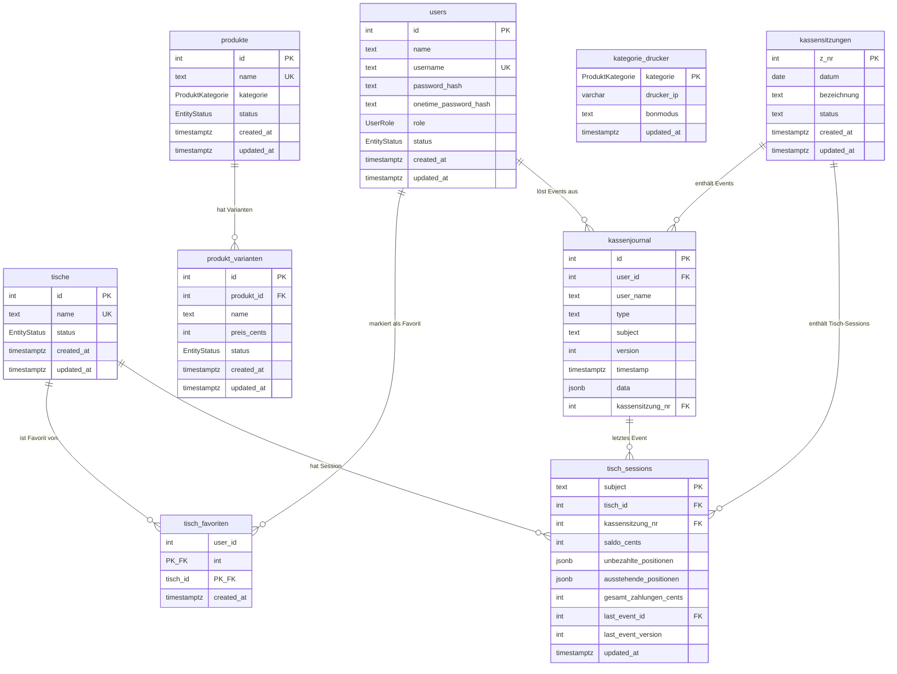

---

## 3. Stammdaten-Tabellen (CRUD)

Stammdaten-Tabellen folgen dem klassischen CRUD-Muster. Datensätze werden nie physisch gelöscht — stattdessen wird `status = 'deleted'` gesetzt (Soft-Delete). Das ist notwendig, weil das `kassenjournal` über referenzielle Integrität auf `users` verweist und Fat Events in historischen Bestellungen auf Produkte und Tische verweisen.

---

### 3.1 `users` — Systembenutzerverwaltung

**Zweck:** Speichert alle Benutzerkonten des Systems. Jede Aktion in jotti ist einem Benutzer zugeordnet — Bestellungen, Zahlungen, Kasseneröffnungen usw.

| Spalte                  | Typ                                         | Zweck                                                                                                                         |
| ----------------------- | ------------------------------------------- | ----------------------------------------------------------------------------------------------------------------------------- |
| `id`                    | INT (PK, auto-increment)                    | Eindeutige interne ID; wird in FK-Beziehungen referenziert                                                                    |
| `name`                  | TEXT                                        | Vollständiger Anzeigename (z. B. „Maria Müller")                                                                              |
| `username`              | TEXT (UNIQUE)                               | Login-Name; muss systemweit eindeutig sein                                                                                    |
| `password_hash`         | TEXT nullable                               | Argon2id-Hash des dauerhaften Passworts; `NULL` wenn noch kein Passwort gesetzt (Neuzugang)                                   |
| `onetime_password_hash` | TEXT nullable                               | Argon2id-Hash eines Einmalpassworts; Admin kann damit Zugangsdaten initial vergeben oder zurücksetzen; nach Verwendung `NULL` |
| `role`                  | ENUM (`admin`, `serviceleitung`, `service`) | Bestimmt, welche Aktionen der Benutzer ausführen darf                                                                         |
| `status`                | ENUM (`active`, `inactive`, `deleted`)      | Kontostatus; `deleted` = Soft-Delete                                                                                          |
| `created_at`            | TIMESTAMPTZ                                 | Erstellungszeitpunkt                                                                                                          |
| `updated_at`            | TIMESTAMPTZ                                 | Letzter Änderungszeitpunkt                                                                                                    |

**Rollen im Detail:**

| Rolle            | Darf...                                                                                                       |
| ---------------- | ------------------------------------------------------------------------------------------------------------- |
| `admin`          | Alles: Stammdaten verwalten, Kassensitzung eröffnen/abschließen, Kassensturz, Stornieren, Bezahlen, Bestellen |
| `serviceleitung` | Stornieren, Auszahlungen leisten, Kassenbewegungen buchen; alles was `service` kann                           |
| `service`        | Bestellen, Ausgabe bestätigen, Bezahlen                                                                       |

**Onboarding-Ablauf:** Admin legt Benutzer an und setzt ein Einmalpasswort via `onetime_password_hash`. Der neue Benutzer loggt sich damit ein und wird aufgefordert, ein dauerhaftes Passwort zu setzen. Danach ist `onetime_password_hash = NULL` und `password_hash` befüllt.

**Warum wird `user_name` auch im `kassenjournal` gespeichert?** Das `kassenjournal` speichert den Benutzernamen zum Zeitpunkt des Events als Fat-Event-Feld (denormalisiert). Dadurch bleibt die historische Aufzeichnung korrekt, auch wenn ein Benutzer später umbenannt oder gelöscht wird.

---

### 3.2 `tische` — Gasttische

**Zweck:** Verwaltet die physischen Tische der Veranstaltung. Servicekräfte nehmen Bestellungen pro Tisch auf; die gesamte Kassenlogik ist tischbezogen.

| Spalte       | Typ                                    | Zweck                                                                                                          |
| ------------ | -------------------------------------- | -------------------------------------------------------------------------------------------------------------- |
| `id`         | INT (PK, auto-increment)               | Eindeutige interne ID                                                                                          |
| `name`       | TEXT (UNIQUE)                          | Anzeigename des Tisches (z. B. „Tisch 1", „VIP-Bereich")                                                       |
| `status`     | ENUM (`active`, `inactive`, `deleted`) | `active` = nutzbar im Service-Betrieb; `inactive` = vorhanden, aber temporär gesperrt; `deleted` = Soft-Delete |
| `created_at` | TIMESTAMPTZ                            | Erstellungszeitpunkt                                                                                           |
| `updated_at` | TIMESTAMPTZ                            | Letzter Änderungszeitpunkt                                                                                     |

**Beziehungen:**

- Ein Tisch kann pro Kassensitzung genau eine aktive `tisch_session` haben.
- Servicekräfte können Tische als Favoriten markieren (`tisch_favoriten`).
- Der Tisch-Name wird **nicht** in Events eingefroren — Fat Events speichern den Tisch-ID + Session-Subject. Der Tischname wird aus der Projektion (`tisch_sessions`) gelesen.

---

### 3.3 `produkte` — Produktkatalog

**Zweck:** Definiert den Katalog der bestellbaren Artikel. Ein Produkt ist der übergeordnete Begriff (z. B. „Bier"); konkrete Ausprägungen mit Preisen sind Varianten.

| Spalte       | Typ                                     | Zweck                                                               |
| ------------ | --------------------------------------- | ------------------------------------------------------------------- |
| `id`         | INT (PK, auto-increment)                | Eindeutige interne ID                                               |
| `name`       | TEXT (UNIQUE)                           | Produktname (z. B. „Bier", „Pizza Margherita")                      |
| `kategorie`  | ENUM (`essen`, `getraenk`, `sonstiges`) | Steuert Drucker-Routing: Welcher Bondrucker erhält den Druckauftrag |
| `status`     | ENUM (`active`, `inactive`, `deleted`)  | Soft-Delete                                                         |
| `created_at` | TIMESTAMPTZ                             | Erstellungszeitpunkt                                                |
| `updated_at` | TIMESTAMPTZ                             | Letzter Änderungszeitpunkt                                          |

**Warum die Kategorie auf `produkte` und nicht auf `produkt_varianten`?**

Die Kategorie steuert das Drucker-Routing über `kategorie_drucker`. Alle Varianten eines Produkts gehören zur gleichen Kategorie (z. B. alle Bier-Varianten → Getränk-Drucker). Das ist eine Invariante des Produktmodells.

---

### 3.4 `produkt_varianten` — Produktvarianten

**Zweck:** Eine Variante ist die konkrete, bestellbare Einheit mit eigenem Preis. Zu „Bier" gehören z. B. die Varianten „0,3l" (200 ct) und „0,5l" (300 ct).

| Spalte        | Typ                                    | Zweck                                                                           |
| ------------- | -------------------------------------- | ------------------------------------------------------------------------------- |
| `id`          | INT (PK, auto-increment)               | Eindeutige interne ID; wird in Bestellungs-Events als `varianteId` referenziert |
| `produkt_id`  | INT (FK → `produkte.id`)               | Zugehöriges Produkt                                                             |
| `name`        | TEXT                                   | Name der Variante (z. B. „0,3l", „klein", „groß")                               |
| `preis_cents` | INT                                    | Preis in Cent (z. B. `199` = 1,99 €); niemals Float                             |
| `status`      | ENUM (`active`, `inactive`, `deleted`) | `inactive` = im Service-Katalog ausgeblendet; nützlich für saisonale Artikel    |
| `created_at`  | TIMESTAMPTZ                            | Erstellungszeitpunkt                                                            |
| `updated_at`  | TIMESTAMPTZ                            | Letzter Änderungszeitpunkt                                                      |

**Preise sind immutable für laufende Bestellungen:** Sobald eine Variante in einem `bestellung-aufgenommen:v1`-Event referenziert wird, werden `preis_cents` und Namen als Fat-Event-Felder eingefroren. Spätere Preisänderungen an der Variante berühren historische Bestellungen nicht.

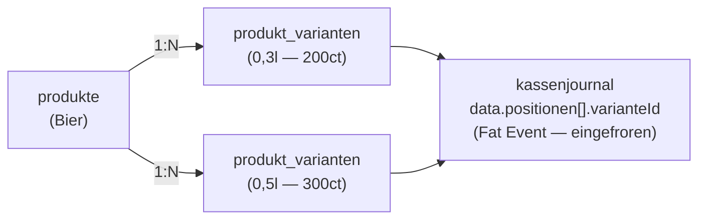

---

### 3.5 `kategorie_drucker` — Druckerkonfiguration

> **Ist-Zustand.** Die Bon-Neuordnung (`docs/prds/prd-bondruck.md`) benennt diese Tabelle zu `druckstationen` um (Arbeitsbon-Stationen) und führt eine Druckauftrags-Outbox (`druckauftraege`) ein; das Relay wird dann zum reinen Transport. Bis zur Umsetzung beschreibt dieser Abschnitt den aktuellen Stand.

**Zweck:** Konfiguriert, welcher Netzwerkdrucker (Bondrucker, ESC/POS) für welche Produktkategorie zuständig ist. Das Relay-Dienst liest diese Konfiguration bei jedem Poll-Aufruf.

| Spalte       | Typ         | Zweck                                                                                                   |
| ------------ | ----------- | ------------------------------------------------------------------------------------------------------- |
| `kategorie`  | ENUM (PK)   | `essen`, `getraenk` oder `sonstiges` — jede Kategorie hat genau eine Konfigurationszeile                |
| `drucker_ip` | VARCHAR(50) | IPv4-Adresse des Bondruckers; leer = kein Drucker konfiguriert (kein Druck)                             |
| `bonmodus`   | TEXT        | `pro_position`: 1 Bon pro bestellter Position; `pro_bestellung`: 1 Sammelbon für die gesamte Bestellung |
| `updated_at` | TIMESTAMPTZ | Letzter Änderungszeitpunkt                                                                              |

**Initialdaten:** Die Migration befüllt alle drei Kategorien mit leerer `drucker_ip` — Drucker-Druck ist defaultmäßig deaktiviert.

**Wie funktioniert der Bondruck?**

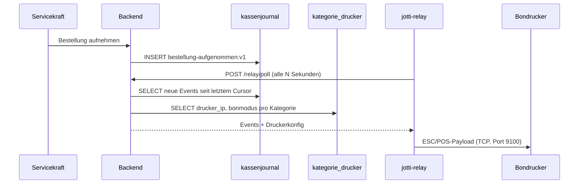

---

### 3.6 `tisch_favoriten` — Lieblingstische pro Benutzer

**Zweck:** Jede Servicekraft kann Tische, für die sie zuständig ist, als Favoriten markieren. Die Service-Tischübersicht kann dann zuerst Favoritentische anzeigen.

| Spalte       | Typ                       | Zweck                            |
| ------------ | ------------------------- | -------------------------------- |
| `user_id`    | INT (PK/FK → `users.id`)  | Benutzer, dem der Favorit gehört |
| `tisch_id`   | INT (PK/FK → `tische.id`) | Der markierte Tisch              |
| `created_at` | TIMESTAMPTZ               | Wann der Favorit angelegt wurde  |

Der zusammengesetzte PK `(user_id, tisch_id)` verhindert Duplikate — jeder Tisch kann pro Benutzer nur einmal als Favorit markiert sein.

---

## 4. Kasse-Tabellen (Event-Sourcing)

Die drei Kasse-Tabellen bilden zusammen ein Event-Sourcing + CQRS-Muster:

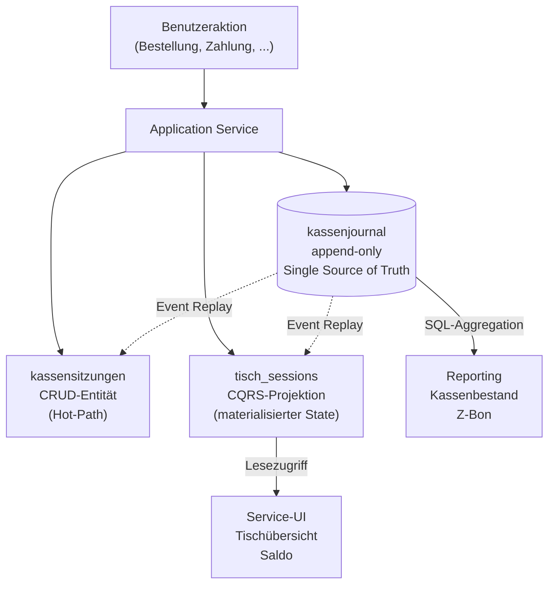

**Wichtig:** `kassensitzungen` und `tisch_sessions` werden in **derselben DB-Transaktion** zusammen mit dem `kassenjournal`-INSERT aktualisiert. Es gibt keinen asynchronen Prozess. Bei Inkonsistenz ist das `kassenjournal` immer die Wahrheit — alles andere kann jederzeit daraus reberechnet werden.

---

### 4.1 `kassensitzungen` — Kassensitzung CRUD-Entität

**Zweck:** Eine Kassensitzung entspricht einem Betriebstag (z. B. „Vereinsfest Tag 1"). Sie ist der administrative Rahmen, in dem alle Kassenoperationen stattfinden. Ohne offene Kassensitzung sind keine Bestellungen möglich.

| Spalte        | Typ                              | Zweck                                                                                       |
| ------------- | -------------------------------- | ------------------------------------------------------------------------------------------- |
| `z_nr`        | INT (PK, auto-increment)         | **DSFinV-K-Pflichtfeld** — fortlaufende, lückenlose Kassenabschlussnummer; nie zurücksetzen |
| `datum`       | DATE                             | Betriebstag der Kassensitzung                                                               |
| `bezeichnung` | TEXT                             | Optionaler Name (z. B. „Sommerfest 2026 Tag 1")                                             |
| `status`      | TEXT (`offen` / `abgeschlossen`) | Lifecycle-Status                                                                            |
| `created_at`  | TIMESTAMPTZ                      | Erstellungszeitpunkt                                                                        |
| `updated_at`  | TIMESTAMPTZ                      | Letzter Änderungszeitpunkt                                                                  |

**Warum existiert diese Tabelle, wenn alles im `kassenjournal` steht?**

Diese Tabelle ist ein **Hot-Path-Read-Modell**. Bei jeder einzelnen Servicekraft-Aktion (Bestellung, Zahlung, ...) muss geprüft werden: „Gibt es eine offene Kassensitzung?" Ein direktes `SELECT` auf `kassenjournal` mit JSON-Parsen wäre deutlich teurer. Die `kassensitzungen`-Tabelle ermöglicht eine simple `SELECT status FROM kassensitzungen WHERE status = 'offen'`-Prüfung.

**Invarianten:**

- Maximal eine Kassensitzung darf gleichzeitig `offen` sein.
- `z_nr` ist fortlaufend und lückenlos (wird beim INSERT als `max(z_nr) + 1` berechnet).
- Status wechselt von `offen` → `abgeschlossen` genau einmal, ausgelöst durch das `tagesabschluss-erstellt:v1`-Event.

---

### 4.2 `kassenjournal` — Event Store

**Zweck:** Das Herzstück des Systems. Chronologisches, unveränderliches Protokoll **aller** finanziellen Geschäftsvorfälle — im Sinne von § 146 AO. Jede Bestellung, Zahlung, Stornierung, Kasseneröffnung, Kassenbewegung und jeder Tagesabschluss landet hier als unveränderlicher Eintrag.

| Spalte             | Typ                               | Zweck                                                                                                              |
| ------------------ | --------------------------------- | ------------------------------------------------------------------------------------------------------------------ |
| `id`               | INT (PK, auto-increment)          | Eindeutige, monoton steigende Event-ID                                                                             |
| `user_id`          | INT (FK → `users.id`)             | Wer hat diese Aktion ausgelöst (für Audit-Trail)                                                                   |
| `user_name`        | TEXT                              | **Fat Event:** Benutzername zum Zeitpunkt des Events; bleibt korrekt, auch wenn der Benutzer später umbenannt wird |
| `type`             | TEXT                              | Event-Typ-Identifier, z. B. `bestellung-aufgenommen:v1`; versioniert mit `:vN`-Suffix                              |
| `subject`          | TEXT                              | Stream-Schlüssel; identifiziert den Event-Stream eindeutig (z. B. `kassensitzung-1/tisch-42`)                      |
| `version`          | INT                               | Aufsteigende Version pro `subject`; bildet zusammen mit `subject` den OCC-Constraint                               |
| `timestamp`        | TIMESTAMPTZ                       | Zeitpunkt des Events (UTC)                                                                                         |
| `data`             | JSONB                             | Event-spezifische Nutzdaten; Schema variiert je nach `type`                                                        |
| `kassensitzung_nr` | INT (FK → `kassensitzungen.z_nr`) | Denormalisiert die Kassensitzungszugehörigkeit für effiziente Cross-Stream-Aggregationen                           |

**Warum `UNIQUE(subject, version)`?**

Dieser Constraint ist der **Optimistic-Concurrency-Control (OCC)**-Mechanismus. Wenn zwei Servicekräfte gleichzeitig am selben Tisch bestellen, lesen beide die aktuelle Version z. B. `version = 5`. Beide versuchen `version = 6` zu schreiben. Der zweite Schreibvorgang scheitert mit einem Unique-Constraint-Fehler → Retry mit neu gelesener Version. So werden Race Conditions ohne pessimistische Locks aufgelöst.

**Subject-Hierarchie:**

```
kassensitzung-1                     ← Kassensitzungs-Stream (globaler Betriebstag)
kassensitzung-1/tisch-42            ← Tisch-Session-Stream (Abrechnungskreis)
kassensitzung-1/tisch-7             ← Tisch-Session-Stream (anderer Tisch)
```

Warum separate Subjects pro Tisch? Damit der OCC-Constraint nur innerhalb eines Tisches serialisiert — nicht global über alle Tische. Bei 5–30 gleichzeitigen Servicekräften wäre ein einziges Subject ein Engpass.

**`kassensitzung_nr` — warum denormalisiert?**

Ohne diese Spalte müsste man für Reporting-Queries ein `LIKE subject = 'kassensitzung-1/%'` nutzen. Das ist fragil und langsam. Mit `kassensitzung_nr` lautet die Reporting-Query einfach `WHERE kassensitzung_nr = 1` — nutzt den Index `idx_kassenjournal_ks_nr`.

**Immutabilität — drei Ebenen:**

```sql
-- Ebene 1: Berechtigung (Defense-in-Depth für Nicht-Owner-Rollen)
REVOKE ALL ON TABLE kassenjournal FROM PUBLIC;
GRANT SELECT, INSERT ON TABLE kassenjournal TO PUBLIC;

-- Ebene 2: DB-Trigger (schützt auch den Table-Owner)
CREATE TRIGGER kassenjournal_no_update BEFORE UPDATE ...
CREATE TRIGGER kassenjournal_no_delete BEFORE DELETE ...
CREATE TRIGGER kassenjournal_no_truncate BEFORE TRUNCATE ...
```

Ebene 1 allein reicht nicht, weil PostgreSQL-Table-Owner Privilege-Checks umgehen können. Die Trigger-Schicht schützt auch vor versehentlichem `UPDATE` durch den Datenbankbesitzer selbst.

---

### 4.3 `tisch_sessions` — CQRS-Projektion

**Zweck:** Materialisierter aktueller Zustand jeder Tisch-Session. Wird bei jeder schreibenden Kassenoperation synchron (in derselben Transaktion) aktualisiert. Ermöglicht schnellen Lesezugriff auf Saldo und offene Positionen ohne Event-Replay.

| Spalte                   | Typ                               | Zweck                                                                                  |
| ------------------------ | --------------------------------- | -------------------------------------------------------------------------------------- |
| `subject`                | TEXT (PK)                         | Stream-Schlüssel, z. B. `kassensitzung-1/tisch-42`; entspricht `kassenjournal.subject` |
| `tisch_id`               | INT (FK → `tische.id`)            | Referenz auf den physischen Tisch                                                      |
| `kassensitzung_nr`       | INT (FK → `kassensitzungen.z_nr`) | Zu welcher Kassensitzung gehört diese Session                                          |
| `saldo_cents`            | INT                               | Aktueller offener Betrag in Cent (0 = alles bezahlt/storniert)                         |
| `unbezahlte_positionen`  | JSONB                             | Array aller bestellten, noch nicht bezahlten Positionen                                |
| `ausstehende_positionen` | JSONB                             | Array aller bestellten, noch nicht ausgegebenen Positionen                             |
| `gesamt_zahlungen_cents` | INT                               | Summe aller bisher kassierten Zahlungen in Cent                                        |
| `last_event_id`          | INT (FK → `kassenjournal.id`)     | ID des zuletzt verarbeiteten Events (für Konsistenzprüfung)                            |
| `last_event_version`     | INT                               | Version des zuletzt verarbeiteten Events                                               |
| `updated_at`             | TIMESTAMPTZ                       | Zeitpunkt der letzten Projektion                                                       |

**Was steckt in den JSONB-Spalten?**

Jede Position ist ein eingebettetes Objekt:

```json
{
  "positionId": "uuid",
  "varianteId": 7,
  "produktName": "Bier",
  "varianteName": "0,5l",
  "kategorie": "getraenk",
  "einzelpreis": 300,
  "menge": 2
}
```

Die Daten werden zum Bestellzeitpunkt aus dem `kassenjournal.data`-JSONB identisch übernommen — sie sind Fat-Event-Daten und damit unveränderlich korrekt.

**Saldo-Formel:**

$$\text{Saldo} = \sum \text{Bestellungen} - \sum \text{Zahlungen} - \sum \text{Stornierungen} + \sum \text{Auszahlungen}$$

Ein Saldo = 0 bedeutet: der Tisch ist vollständig abgerechnet. Ein Saldo < 0 kann entstehen, wenn bereits bezahlte Positionen nachträglich storniert werden (z. B. Qualitätsmangel). Eine `AuszahlungGeleistet` gleicht diesen negativen Betrag aus.

**Apply-Tabelle — wie Events den Zustand verändern:**

| Event                       | Auswirkung auf `tisch_sessions`                                                      |
| --------------------------- | ------------------------------------------------------------------------------------ |
| `bestellung-aufgenommen:v1` | Saldo ↑, Positionen zu `unbezahlte_positionen` + `ausstehende_positionen` hinzufügen |
| `ausgabe-bestaetigt:v1`     | Mengen aus `ausstehende_positionen` abziehen                                         |
| `zahlung-kassiert:v1`       | Saldo ↓, Mengen aus `unbezahlte_positionen` abziehen, `gesamt_zahlungen_cents` ↑     |
| `stornierung-erteilt:v1`    | Saldo ↓, Mengen aus `unbezahlte_positionen` + `ausstehende_positionen` abziehen      |
| `auszahlung-geleistet:v1`   | Saldo ↑ (negativen Saldo ausgleichen) — keine Positionslisten-Änderung               |

---

## 5. Domain Events im kassenjournal

Das `kassenjournal` speichert zwei Kategorien von Events, erkennbar am `subject`-Muster:

### Tisch-Session-Events (`subject = "kassensitzung-N/tisch-M"`)

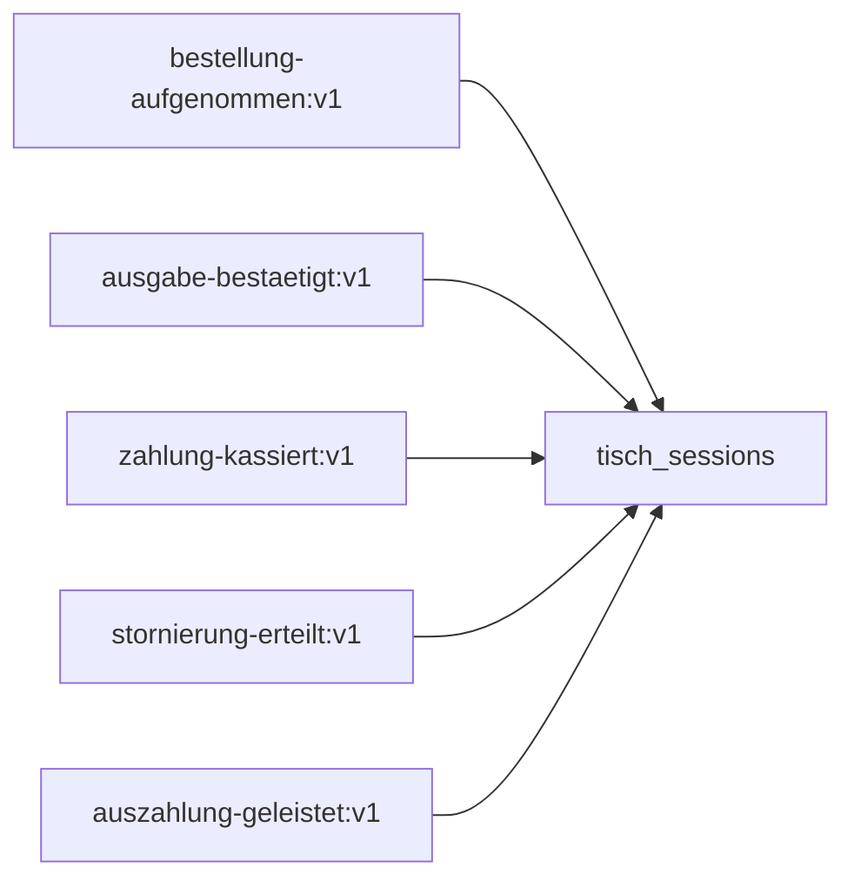

| Event-Typ                   | Auslöser                               | Pflichtfelder in `data`                                                          |
| --------------------------- | -------------------------------------- | -------------------------------------------------------------------------------- |
| `bestellung-aufgenommen:v1` | Servicekraft nimmt Bestellung auf      | `bestellungId`, `positionen[]`, `gesamtPreisCents`                               |
| `ausgabe-bestaetigt:v1`     | Ausgabe einer Bestellung bestätigen    | `ausgabeId`, `positionen[]`                                                      |
| `zahlung-kassiert:v1`       | Barzahlung kassieren                   | `zahlungId`, `positionen[]`, `gesamtZahlungCents`                                |
| `stornierung-erteilt:v1`    | Stornierung (nur serviceleitung/admin) | `stornierungId`, `positionen[]`, `gesamtStornierungCents`, `kommentar` (Pflicht) |
| `auszahlung-geleistet:v1`   | Auszahlung für negativen Saldo         | `auszahlungId`, `betragCents`, `kommentar` (Pflicht)                             |

### Kassensitzungs-Events (`subject = "kassensitzung-N"`)

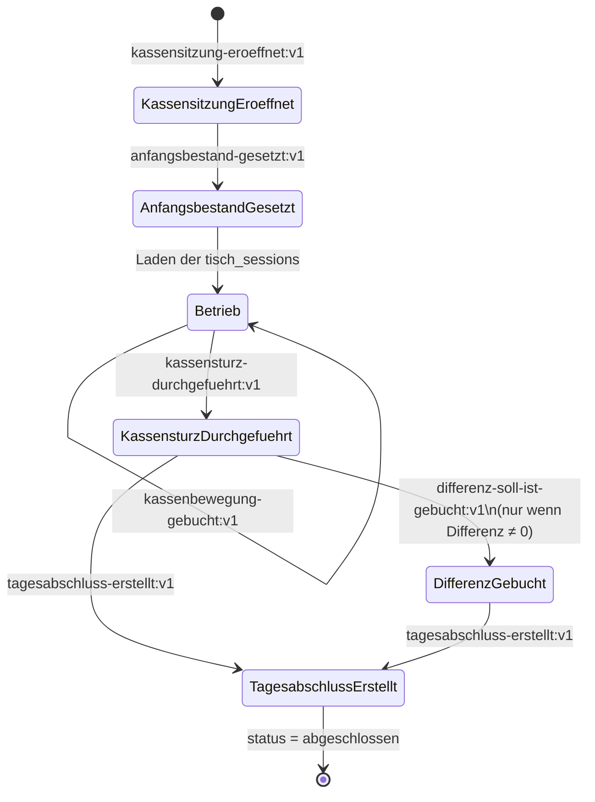

| Event-Typ                       | Auslöser                                 | Ziel                                          |
| ------------------------------- | ---------------------------------------- | --------------------------------------------- |
| `kassensitzung-eroeffnet:v1`    | Admin eröffnet Kassensitzung             | kassensitzungen INSERT                        |
| `anfangsbestand-gesetzt:v1`     | Admin definiert Wechselgeld              | nur kassenjournal                             |
| `kassenbewegung-gebucht:v1`     | Geldtransit/Privatentnahme/Privateinlage | nur kassenjournal                             |
| `kassensturz-durchgefuehrt:v1`  | Admin zählt Bargeld                      | nur kassenjournal                             |
| `differenz-soll-ist-gebucht:v1` | Automatisch wenn Soll ≠ Ist              | nur kassenjournal                             |
| `tagesabschluss-erstellt:v1`    | Admin schließt Kassensitzung             | kassensitzungen UPDATE status='abgeschlossen' |

---

## 6. Das transaktionale Zusammenspiel

Jede schreibende Kassenaktion führt genau eine Datenbanktransaktion aus, die **atomisch** alle drei Kasse-Tabellen aktualisiert:

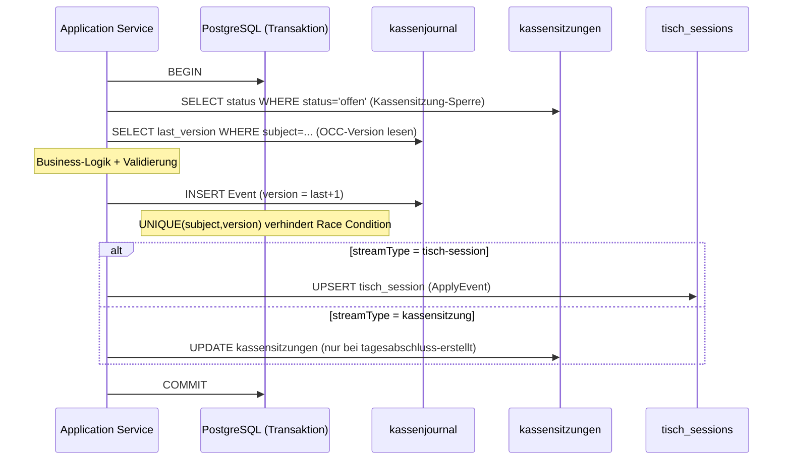

**Was passiert bei einem Race Condition?**

Zwei Servicekräfte kaufen gleichzeitig am selben Tisch:

```
Servicekraft A liest version = 5
Servicekraft B liest version = 5
Servicekraft A schreibt version = 6 → ERFOLG
Servicekraft B versucht version = 6 → FEHLER (UNIQUE constraint)
Servicekraft B liest erneut version = 6
Servicekraft B schreibt version = 7 → ERFOLG
```

Der UNIQUE-Constraint `(subject, version)` ist der einzige Synchronisierungsmechanismus — kein pessimistisches Locking, keine Queue.

---

## 7. Lebenszyklen und Zustandsmaschinen

### Kassensitzung-Lifecycle

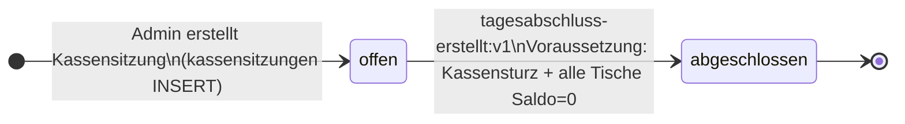

### Tisch-Session (impliziter Lifecycle)

Eine Tisch-Session hat keinen expliziten `status`-Wert. Ihr Zustand ergibt sich aus dem `saldo_cents` und den Positionslisten:

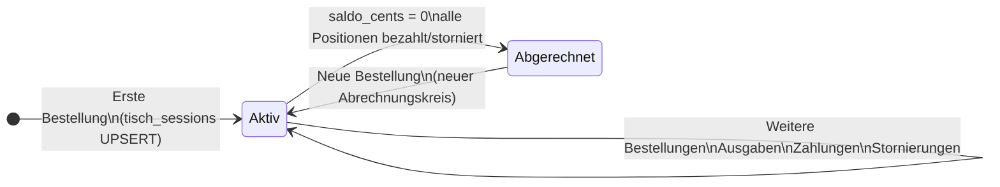

### Produkt-Soft-Delete

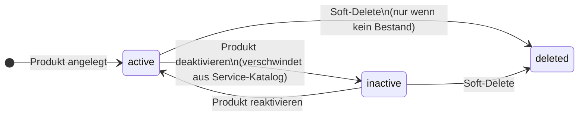

---

## 8. Sicherheitsmechanismen

### Immutabilität des kassenjournal (drei Schichten)

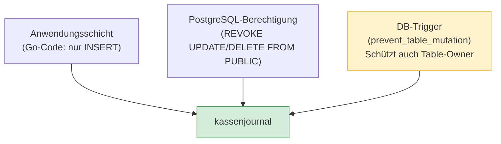

### Insert-once-Schutz der kassenidentitaet

Die Singleton-Tabelle `kassenidentitaet` (Seriennummer + Inbetriebnahmedatum) wird einmalig bei der DB-Migration befüllt und ist danach vollständig read-only. Anders als das `kassenjournal` (append-only) erlaubt sie auch keine weiteren `INSERT`s. Der Schutz greift in zwei Schichten:

- **PostgreSQL-Berechtigung:** `REVOKE ALL FROM PUBLIC` + nur `GRANT SELECT` (kein INSERT).
- **DB-Trigger:** vier Trigger (`no_insert`, `no_update`, `no_delete`, `no_truncate`) rufen dieselbe generische Funktion `prevent_table_mutation()` auf und schützen so auch den Table-Owner.

### Reporting-Hilfsfunktionen

Für Reporting-Queries gibt es vier immutable SQL-Funktionen, die das `CASE WHEN`-Extraktionsmuster für Geldbeträge enkapsulieren:

```sql
kj_extract_zahlung_cents(type, data)      -- zahlung-kassiert:v1
kj_extract_auszahlung_cents(type, data)   -- auszahlung-geleistet:v1
kj_extract_bestellung_cents(type, data)   -- bestellung-aufgenommen:v1
kj_extract_stornierung_cents(type, data)  -- stornierung-erteilt:v1
```

Diese Funktionen sind `IMMUTABLE` (PostgreSQL kann sie in Indizes und CTEs optimieren) und haben die Event-Typ-Strings nur an einer einzigen Stelle definiert. Berichtserstellung erfolgt direkt via SQL-Aggregation über das `kassenjournal` — kein separates Data-Warehouse.

---

## Zusammenfassung: Welche Tabelle wofür lesen?

| Use-Case                           | Tabelle(n)                                                     |
| ---------------------------------- | -------------------------------------------------------------- |
| Login prüfen                       | `users`                                                        |
| Service-Katalog anzeigen           | `produkte` + `produkt_varianten` (WHERE status='active')       |
| Tischübersicht mit Saldo           | `tisch_sessions` JOIN `tische`                                 |
| Tisch-Historie anzeigen            | `kassenjournal` WHERE subject = '...'                          |
| Offene Kassensitzung prüfen        | `kassensitzungen` WHERE status='offen'                         |
| Kassenbestand berechnen            | `kassenjournal` WHERE kassensitzung_nr = N (SQL-Aggregation)   |
| Z-Bon erstellen                    | `kassenjournal` WHERE kassensitzung_nr = N + `kassensitzungen` |
| Drucker-IP ermitteln               | `kategorie_drucker` WHERE kategorie = '...'                    |
| Favoritentische einer Servicekraft | `tisch_favoriten` WHERE user_id = N                            |
