# Diagramme — jotti

Visuelle Dokumentation der Fachlichkeit (DDD) und Architektur von jotti.
Alle Diagramme bilden den **aktuellen Implementierungsstand** ab. Geplante Features (TSE, DSFinV-K, Betreiber-Stammdaten) sind mit _(geplant)_ gekennzeichnet.

> **Referenzen:** [anforderungen.md](anforderungen.md) · [handbuch.md](handbuch.md) · [language.md](language.md) · [roadmap.md](roadmap.md) · [compliance.md](compliance.md)

---

## Inhaltsverzeichnis

1. [Systemkontext](#1--systemkontext)
2. [Bounded Context Map](#2--bounded-context-map)
3. [Rollen und Berechtigungen](#3--rollen-und-berechtigungen)
4. [Kassenbetrieb — Tisch-Aggregat (Zustandsdiagramm)](#4--kassenbetrieb--tisch-aggregat-zustandsdiagramm)
5. [Kassenbetrieb — Domain Events und Saldo-Fluss](#5--kassenbetrieb--domain-events-und-saldo-fluss)
6. [Kassenbetrieb — Bestellvorgang (Sequenz)](#6--kassenbetrieb--bestellvorgang-sequenz)
7. [Stammdaten — Domain Model](#7--stammdaten--domain-model)
8. [Kassenführung — Lifecycle](#8--kassenführung--lifecycle)
9. [Kassenführung — Kassenbestand-Berechnung](#9--kassenführung--kassenbestand-berechnung)
10. [Auth und Onboarding](#10--auth-und-onboarding)
11. [Schichtenarchitektur (Backend)](#11--schichtenarchitektur-backend)
12. [Event Sourcing: Synchrone Projektion + CRUD-Entität](#12--event-sourcing-synchrone-projektion--crud-entität)
13. [Bondruck — Relay-Architektur](#13--bondruck--relay-architektur)
14. [Deployment-Architektur](#14--deployment-architektur)
15. [API-Bereichsgliederung](#15--api-bereichsgliederung)
16. [Fiskalkonformität — Compliance-Architektur](#16--fiskalkonformität--compliance-architektur)
17. [Datenbank-Schema (ER-Diagramm)](#17--datenbank-schema-er-diagramm)
18. [Frontend-Seitenstruktur](#18--frontend-seitenstruktur)

---

## 1 · Systemkontext

Wer interagiert mit jotti? Welche externen Systeme sind angebunden?

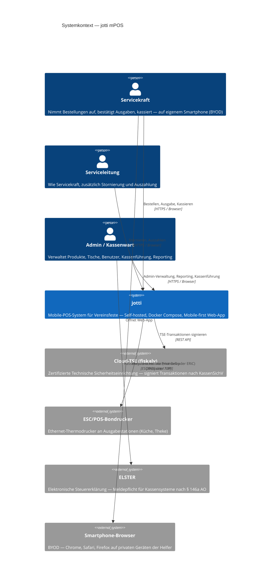

---

## 2 · Bounded Context Map

Die drei Bounded Contexts von jotti und ihre Beziehungen nach DDD-Patterns.

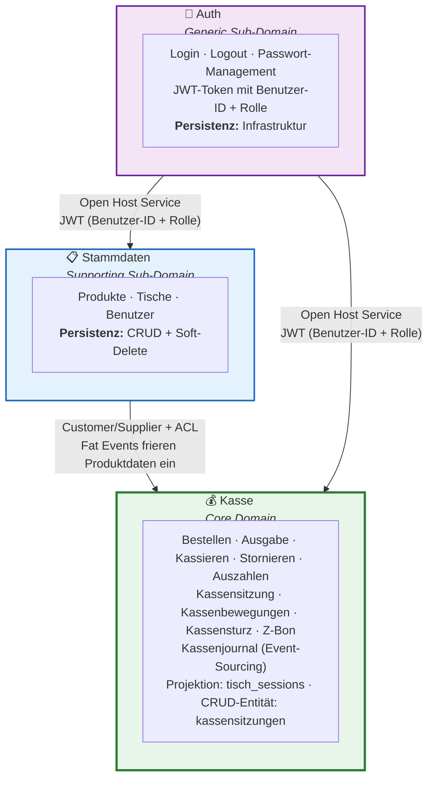

---

## 3 · Rollen und Berechtigungen

Welche Rollen gibt es und was dürfen sie?

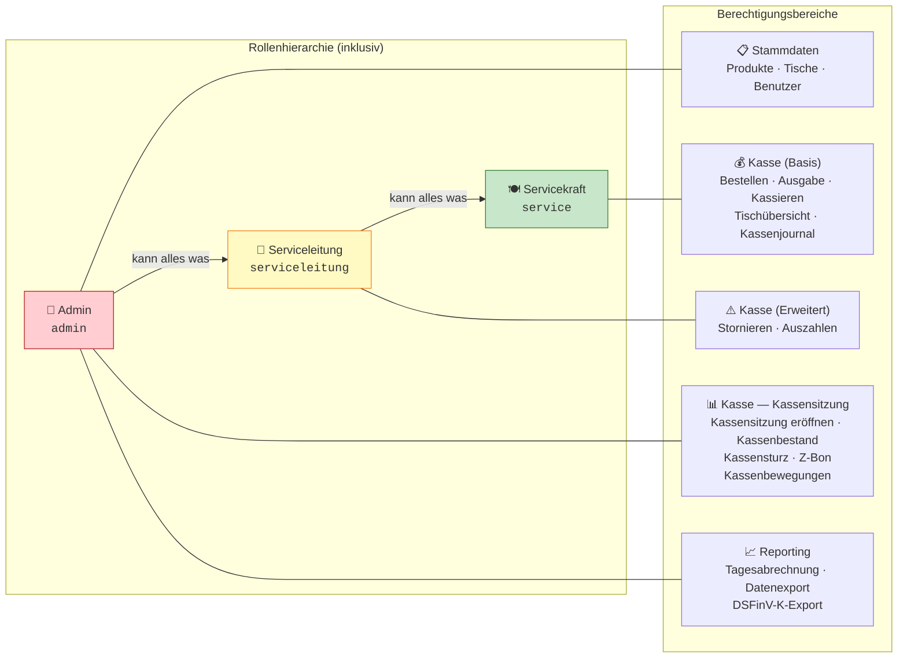

---

## 4 · Kasse — Tisch-Session (Zustandsdiagramm)

Die Tisch-Session (Abrechnungskreis) ist das Event-Sourced-Aggregat im Kasse-Kontext. Entsteht implizit mit der ersten Bestellung innerhalb einer Kassensitzung. Subject: `kassensitzung-{nr}/tisch-{id}`.

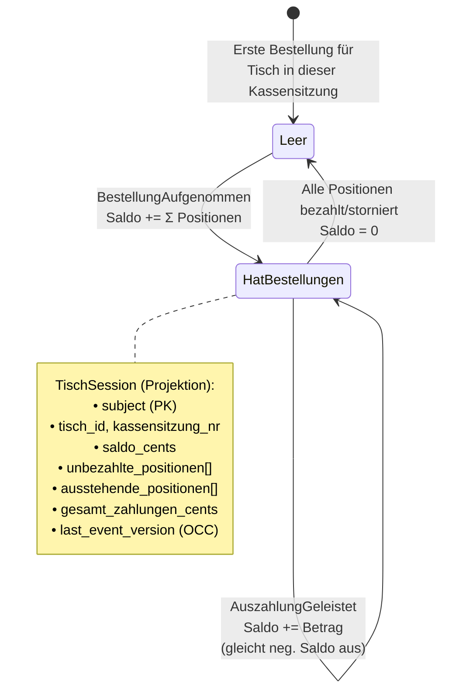

---

## 5 · Kasse — Domain Events

Alle Event-Typen des Kasse-Kontexts. Tisch-Events verändern den Saldo einer Tisch-Session, Kassensitzung-Events steuern den Betriebstag.

### Tisch-Session-Events (Subject: `kassensitzung-{nr}/tisch-{id}`)

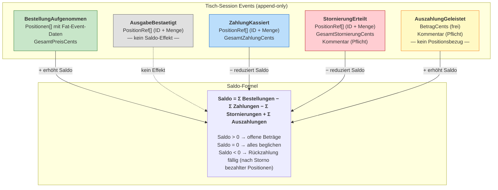

### Kassensitzung-Events (Subject: `kassensitzung-{nr}`)

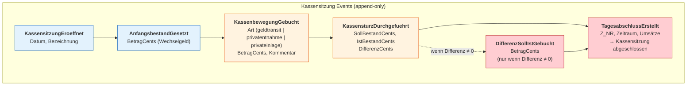

---

## 6 · Kasse — Bestellvorgang (Sequenz)

Vom Tap der Servicekraft bis zum persistierten Event. Vor jeder Tisch-Operation prüft der Application Service die Kassensitzung-Sperre. _(TSE-Signierung ist geplant, aber noch nicht implementiert.)_

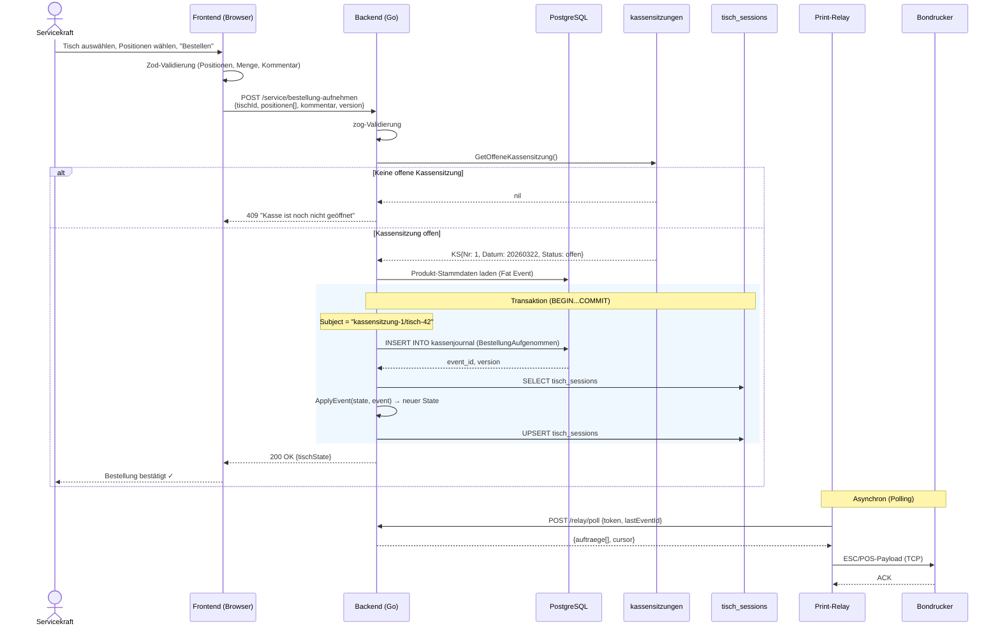

---

## 7 · Stammdaten — Domain Model

Die CRUD-verwalteten Aggregate des Stammdaten-Context.

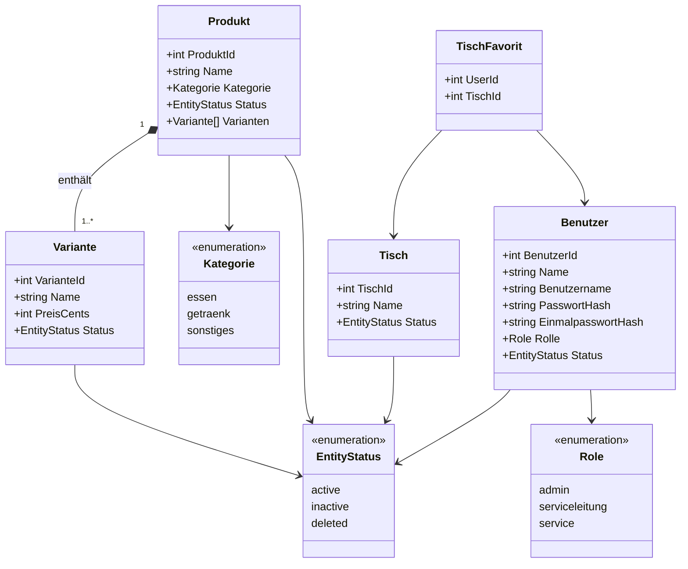

---

## 8 · Kassensitzung-Lifecycle

Der vollständige Ablauf einer Kassensitzung von Eröffnung bis Tagesabschluss — alle Vorgänge als Events im Kassenjournal.

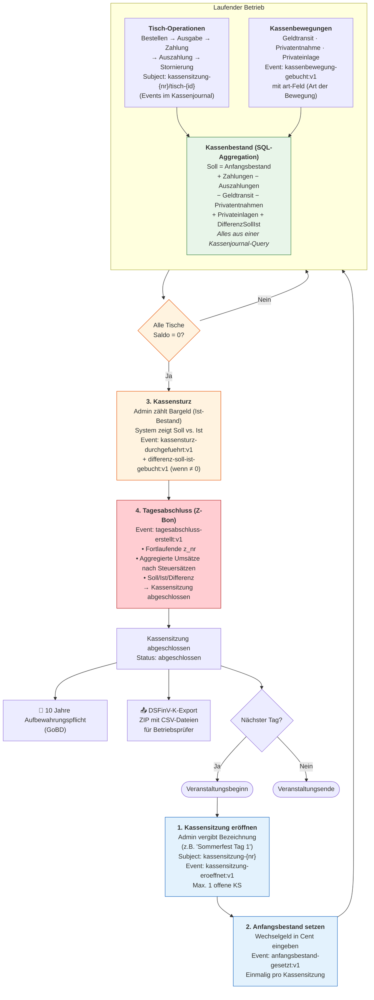

---

## 9 · Kasse — Kassenbestand-Berechnung

Woher die Werte für den Soll-Kassenbestand kommen — eine einzige SQL-Aggregation über das Kassenjournal.

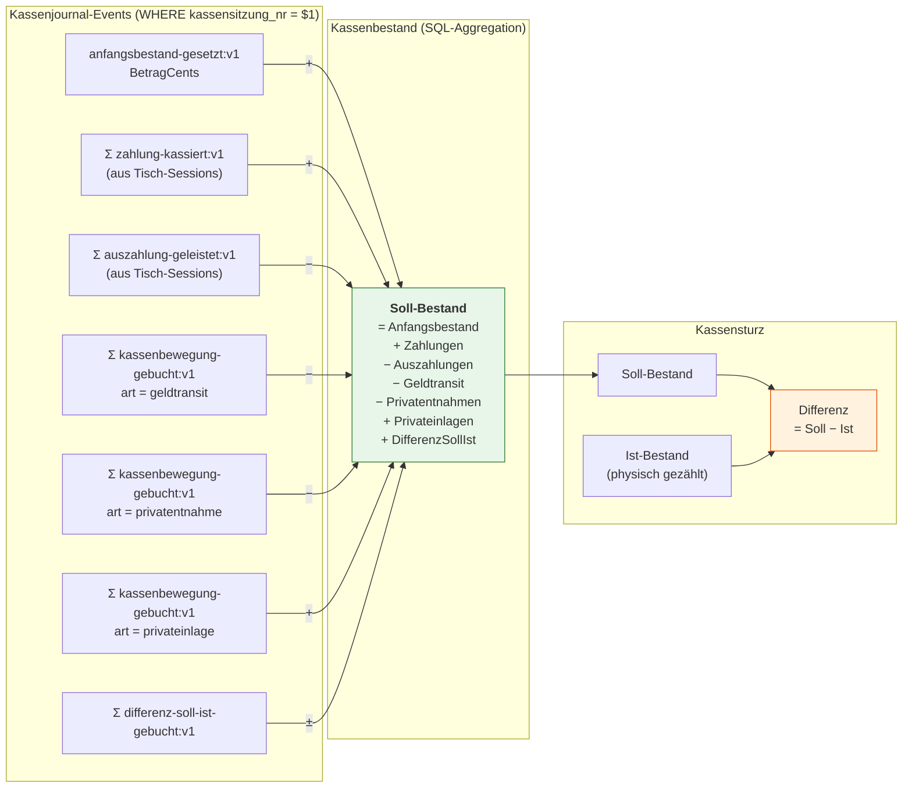

---

## 10 · Auth und Onboarding

Der zweistufige Onboarding-Prozess und der normale Login-Flow.

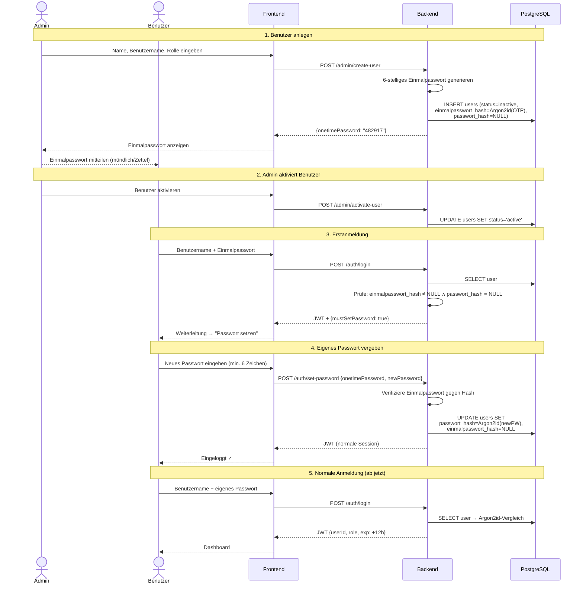

---

## 11 · Schichtenarchitektur (Backend)

Die vier Schichten des Go-Backends mit Verantwortlichkeiten und Abhängigkeitsrichtung.

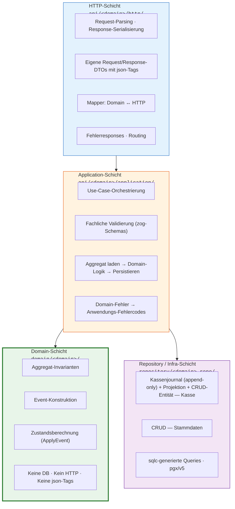

---

## 12 · Event Sourcing: Synchrone Projektion + CRUD-Entität

Write-Through: Event und Tisch-Session-Projektion in derselben Transaktion. Kassensitzung als CRUD-Entität (kein Projection-Update im Event-Pfad).

```mermaid
sequenceDiagram
    participant AS as Application Service
    participant Repo as Kassenjournal Repository
    participant DB as PostgreSQL
    participant KJ as kassenjournal (Event Store)
    participant KSP as kassensitzungen
    participant TSS as tisch_sessions
    participant Dom as Domain (ApplyEvent)

    AS->>Repo: WriteEvent(event, streamType)

    rect rgb(240, 248, 255)
        Note over Repo,Dom: BEGIN TRANSACTION
        Repo->>KJ: INSERT INTO kassenjournal (...)<br/>RETURNING event_id, version
        Note over KJ: UNIQUE (subject, version) → OCC
        KJ-->>Repo: event_id, version

        alt streamType = "tisch-session"
            Repo->>TSS: SELECT * FROM tisch_sessions<br/>WHERE subject = ?
            TSS-->>Repo: aktueller State (oder Zero-Value)
            Repo->>Dom: ApplyEvent(state, event)
            Note over Dom: Reine Funktion — kein DB-Zugriff
            Dom-->>Repo: neuer TischSession
            Repo->>TSS: UPSERT tisch_sessions SET<br/>saldo_cents, unbezahlte_positionen,<br/>ausstehende_positionen, ...

        Note over Repo,Dom: COMMIT
    end

    Repo-->>AS: event_id

    Note over AS,TSS: Lesezugriff (Query)
    AS->>TSS: SELECT saldo_cents,<br/>unbezahlte_positionen, ...<br/>FROM tisch_sessions<br/>WHERE subject = ?
    Note over TSS: Kein Event-Replay nötig!
```

---

## 13 · Bondruck — Relay-Architektur

Wie Bestellungen von der Datenbank zum Bondrucker gelangen.

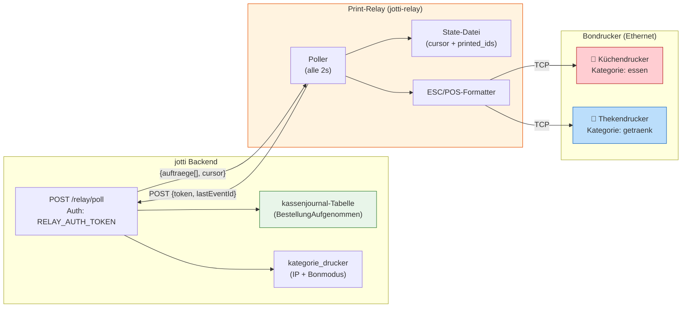

**Bonformate:**

| Bonmodus         | Beschreibung                                                           |
| ---------------- | ---------------------------------------------------------------------- |
| `pro_position`   | 1 Bon pro Position — Tischname (groß/fett) + 1 Position (doppelt hoch) |
| `pro_bestellung` | 1 Sammelbon pro Kategorie — Tischname + alle Positionen der Kategorie  |

---

## 14 · Deployment-Architektur

Docker-Compose-Stack für Self-Hosting.

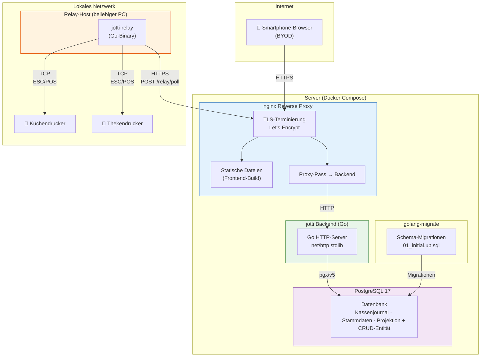

---

## 15 · API-Bereichsgliederung

Alle API-Endpunkte gruppiert nach Bereich und Berechtigung. Alle Endpunkte sind POST-only.

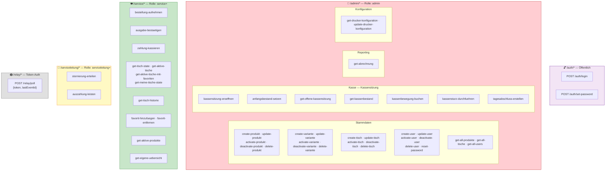

---

## 16 · Fiskalkonformität — Compliance-Architektur

Wie die Compliance-Komponenten (TSE, DSFinV-K, ELSTER) ins System integriert werden.

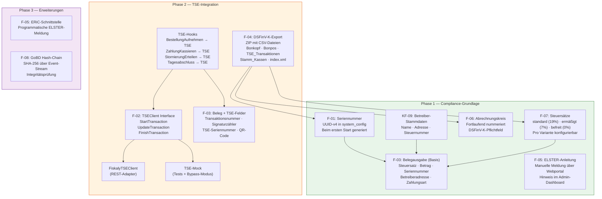

---

## 17 · Datenbank-Schema (ER-Diagramm)

Alle Tabellen des aktuellen Schemas — Domänen-Tabellen deutsch, Infrastruktur-Tabellen englisch.

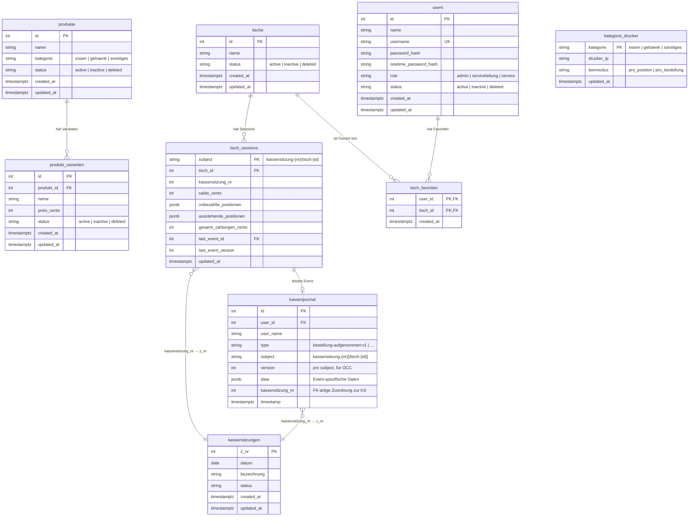

---

## 18 · Frontend-Seitenstruktur

Navigation und Seitenstruktur der Mobile-first Web-App.

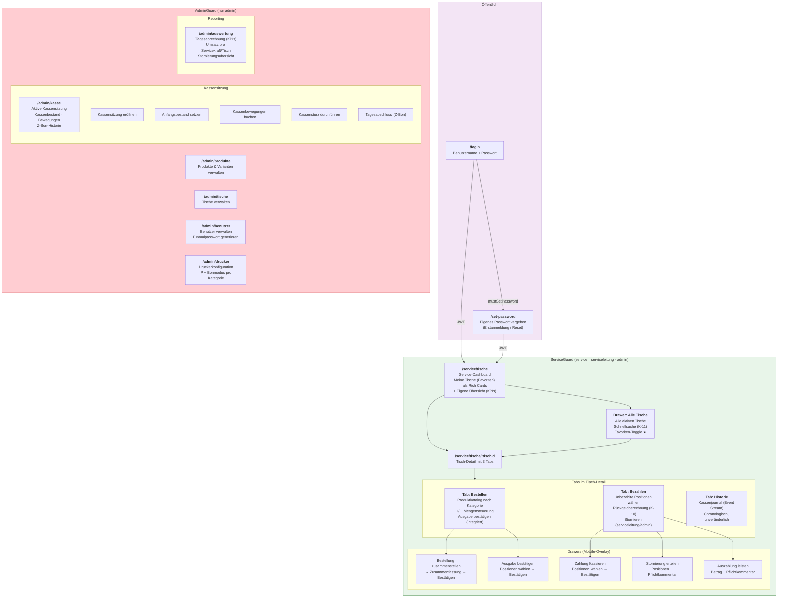
