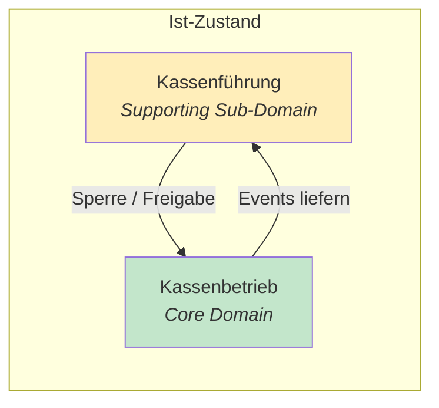
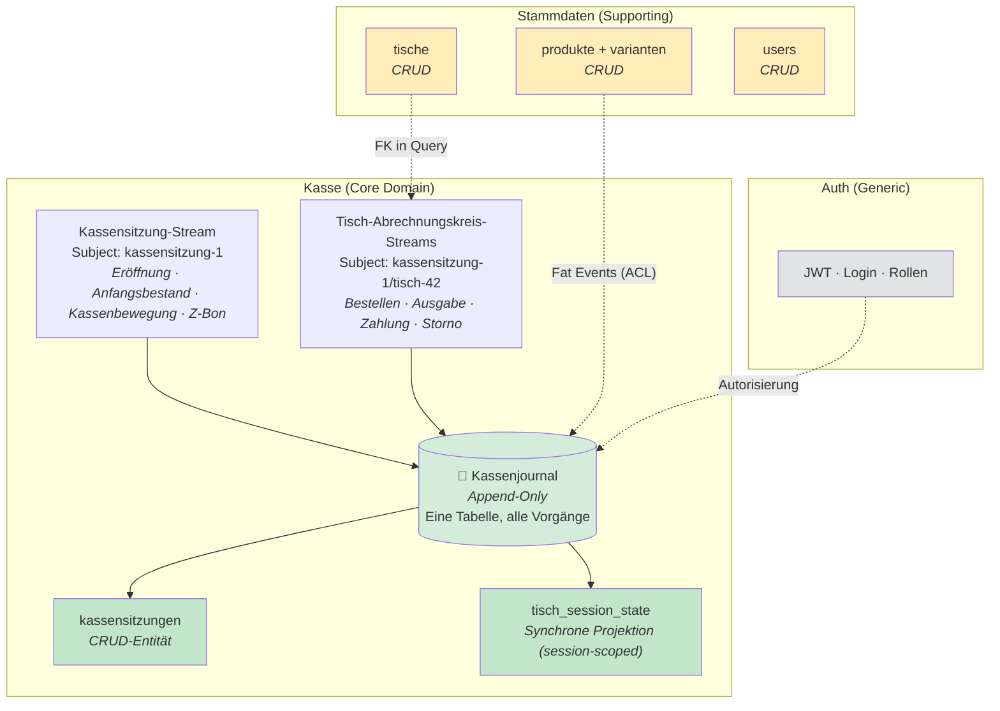
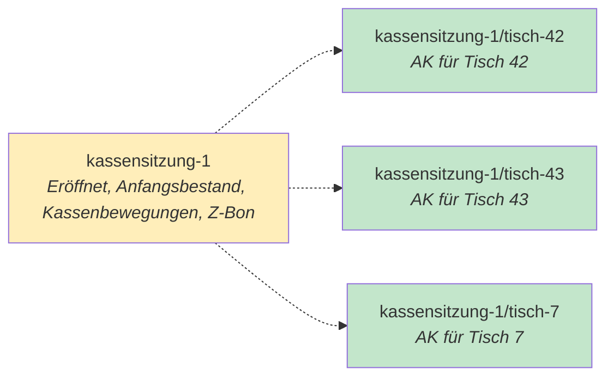
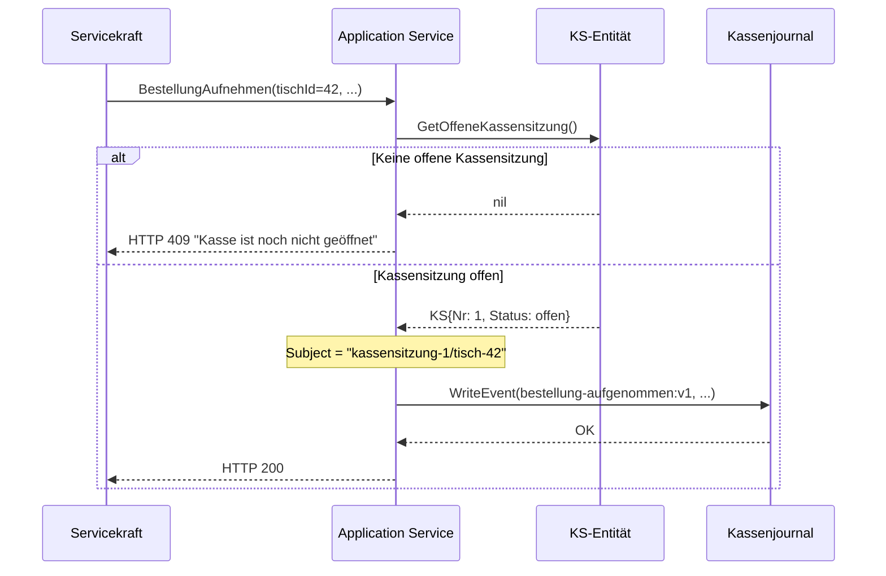
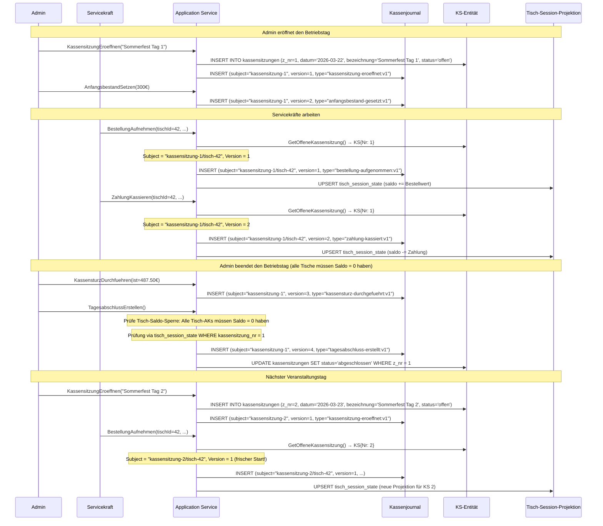

# Redesign: Kassenjournal als vereinigte Core Domain

## Inhaltsverzeichnis

1. [Kontext und Motivation](#1-kontext-und-motivation)
2. [Analyse: Probleme des aktuellen Modells](#2-analyse-probleme-des-aktuellen-modells)
3. [Neukonzeption: Kassenjournal als Core Domain](#3-neukonzeption-kassenjournal-als-core-domain)
4. [Pro und Contra](#4-pro-und-contra)
5. [Empfehlung](#5-empfehlung)
6. [Umsetzungsplan](#6-umsetzungsplan)
7. [Architektur-Review: Aggregate Roots, Entitäten und Subject-Format](#7-architektur-review-aggregate-roots-entitäten-und-subject-format)

---

## 1. Kontext und Motivation

### 1.1 Ausgangslage

Das aktuelle Domänenmodell (Stand: `handbuch.md`) trennt zwei Bounded Contexts:

| Context           | Typ                   | Persistenz        |
| ----------------- | --------------------- | ----------------- |
| **Kassenbetrieb** | Core Domain           | Event-Sourcing    |
| **Kassenführung** | Supporting Sub-Domain | Immutable Records |

Die Kassenführung (Abrechnungskreis, Kassenbewegungen, Kassensturz, Z-Bon) ist aktuell als **Supporting Sub-Domain** mit **Immutable Records** (INSERT-only) modelliert:

> _„Kein OCC-Bedarf, kein Replay-Bedarf, Einfachheit."_ — handbuch.md §5.1

Die Kassenführung ist **noch nicht implementiert** — es gibt weder Domain-Code, noch Repositories, noch DB-Tabellen. Das Fenster für ein Redesign ist optimal.

### 1.2 These

> **Kassenbetrieb und Kassenführung gehören zu einer einzigen Core Domain „Kasse". Der Event Store wird zum Kassenjournal — einer einzigen Tabelle für alle finanziellen Geschäftsvorfälle. Die Kassensitzung bildet den globalen Betriebstag ab. Jeder Tisch innerhalb einer Kassensitzung bildet einen eigenständigen Abrechnungskreis (= Tisch-Session). Der Tisch wird als Stammdaten-Entität von der Kasse getrennt.**

---

## 2. Analyse: Probleme des aktuellen Modells

### 2.1 Bidirektionale Abhängigkeit

Das Handbuch definiert:

- **Kassenbetrieb → Kassenführung:** Events (ZahlungKassiert, StornierungErteilt, AuszahlungGeleistet) fließen in Kassenbestand und Reporting
- **Kassenführung → Kassenbetrieb:** Abrechnungskreis-Status sperrt/gibt Tischoperationen frei



Diese bidirektionale Kopplung deutet darauf hin, dass die Verantwortlichkeiten eng genug verwoben sind, um in einem gemeinsamen Bounded Context kohärenter zu sein. Kassenbetrieb und Kassenführung teilen dieselben Daten (Events/Vorgänge), dieselben Invarianten (Kassenbestand darf nicht negativ werden) und denselben Lebenszyklus (Kassensitzung). Die Trennung erzwingt Cross-Context-Kommunikation für etwas, das fachlich zusammengehört.

### 2.2 Der Abrechnungskreis ist pro Tisch, nicht global

Das `handbuch.md` definiert den Abrechnungskreis als globale Kassensitzung. Die `abrechnungskreis.md`-Erkenntnisse zeigen: Der `ABRECHNUNGSKREIS` im Sinne der DSFinV-K ist **pro Tisch und Tag** (`Tisch-{Nr}-{YYYYMMDD}`), nicht ein einzelner Schlüssel für den gesamten Tag aller Tische. Ein tagesbasierter Gesamt-Schlüssel wäre ein Verstoß gegen die GoBD-Anforderung der Nachvollziehbarkeit.

**Konsequenz:** Was das Handbuch „Abrechnungskreis" nennt, vermischt zwei verschiedene Konzepte:

| Konzept                  | Granularität                 | Verantwortung                                                       |
| ------------------------ | ---------------------------- | ------------------------------------------------------------------- |
| **Globaler Betriebstag** | 1× pro Veranstaltungstag     | Tageseröffnung, Anfangsbestand, Kassenbewegungen, Z-Bon             |
| **Abrechnungskreis**     | 1× pro Tisch pro Betriebstag | DSFinV-K `ABRECHNUNGSKREIS`, Bestellungen, Zahlungen, Stornierungen |

### 2.3 Doppelrolle des Tisches

Im aktuellen Modell erfüllt der „Tisch" zwei Rollen:

| Rolle                | Kontext       | Verantwortung                                                                                              |
| -------------------- | ------------- | ---------------------------------------------------------------------------------------------------------- |
| **Physischer Tisch** | Stammdaten    | Ein Ort, an dem Gäste sitzen. Hat einen Namen, Status (active/inactive/deleted), wird vom Admin verwaltet. |
| **Tisch-Aggregat**   | Kassenbetrieb | Transaktionsgrenze für Bestellungen, Zahlungen, Stornierungen. Event-Sourced, mit OCC und Invarianten.     |

Der physische Tisch Nr. 42 ist ein **zeitloses Stammdatum**. Das Tisch-Aggregat mit Subject `tisch:42` hingegen ist ein **unbegrenzter, stetig wachsender Event-Stream**, der alle Bestellungen seit Beginn der Zeitrechnung akkumuliert. Es fehlt der natürliche Lebenszyklus: Niemand erwartet, dass der Maihock-Saldo vom Mai beim Weihnachtsmarkt im Dezember weitergezählt wird.

### 2.4 Zwei Persistenzstrategien ohne Grund

Das Handbuch begründet die Wahl von Immutable Records für die Kassenführung mit drei Argumenten:

| Argument             | Gegenkritik                                                                                                                                                   |
| -------------------- | ------------------------------------------------------------------------------------------------------------------------------------------------------------- |
| _Kein OCC-Bedarf_    | OCC ist bei ES kostenlos mitgeliefert und schadet nicht. ES hat unabhängig davon Vorteile (Auditierbarkeit, Replay).                                          |
| _Kein Replay-Bedarf_ | Doch: Der Kassenbestand ist eine Projektion über Kassenbetrieb-Events **plus** eigene Records. Bei einem Event Store entfällt die hybride Berechnung.         |
| _Einfachheit_        | Ein einzelner Event Store für die gesamte Kasse ist langfristig **einfacher** als zwei Persistenzstrategien (ES + Immutable Records) mit Cross-Context-Logik. |

### 2.5 Compliance-Realität: Ein Aufzeichnungssystem

Die KassenSichV definiert jotti als **ein** elektronisches Aufzeichnungssystem. Der DSFinV-K-Export verlangt eine einheitliche Vorgangs-Sicht: Jeder Vorgang (Bestellung, Zahlung, Storno, Kassenbewegung) muss in denselben CSV-Dateien (`Bonkopf.csv`, `Bonpos.csv`) erscheinen — verknüpft über denselben `ABRECHNUNGSKREIS`. Die künstliche Trennung in zwei Kontexte mit zwei Persistenzstrategien erschwert diesen Export.

---

## 3. Neukonzeption: Kassenjournal als Core Domain

### 3.1 Grundidee



**Drei Bounded Contexts, eine klare Rolle für jeden:**

| Context        | Typ         | Verantwortung                                                                                          | Persistenz                     |
| -------------- | ----------- | ------------------------------------------------------------------------------------------------------ | ------------------------------ |
| **Kasse**      | Core Domain | Alle finanziellen Geschäftsvorfälle: Bestellen, Bezahlen, Stornieren, Kassenbewegungen, Tagesabschluss | Event-Sourcing (Kassenjournal) |
| **Stammdaten** | Supporting  | Tische, Produkte, Benutzer verwalten                                                                   | CRUD                           |
| **Auth**       | Generic     | Login, Token, Rollen                                                                                   | Infrastruktur                  |

**Kernänderungen gegenüber dem Status Quo:**

1. **Ein Kassenjournal statt `events`-Tabelle** — fachlicher Name, dasselbe Schema
2. **Kassensitzung als globaler Betriebstag** — Subject `kassensitzung-{nr}` für Tageseröffnung, Kassenbewegungen, Z-Bon
3. **Abrechnungskreis = Tisch-Session** — Subject `kassensitzung-{nr}/tisch-{tischId}` pro Tisch pro Kassensitzung
4. **Physischer Tisch nur in Stammdaten** — die Tisch-Session (Abrechnungskreis) ist das Aggregat im Kasse-Kontext
5. **Keine bidirektionale Abhängigkeit** — alles ist ein Kontext
6. **Session-scoped `tisch_session_state`-Projektion** — ersetzt die globale `table_state` durch eine kassensitzungsbezogene Projektion mit natürlichem Lebenszyklus
7. **`kassensitzungen` als CRUD-Entität** — ersetzt die `kassensitzung_state`-Projektion (siehe §7.3)

---

### 3.2 Begriffsklärung: Kassensitzung und Abrechnungskreis

Die beiden Konzepte standen im bisherigen Modell synonym. Im neuen Modell haben sie klar getrennte Bedeutungen:

| Begriff              | Scope                            | DSFinV-K-Feld                  | Beschreibung                                                                                                                                                                                                                                                                                                                                                   |
| -------------------- | -------------------------------- | ------------------------------ | -------------------------------------------------------------------------------------------------------------------------------------------------------------------------------------------------------------------------------------------------------------------------------------------------------------------------------------------------------------- |
| **Kassensitzung**    | Global, 1× pro Veranstaltungstag | `Z_NR` (Kassenabschlussnummer) | Der administrative Rahmen: Eröffnung durch Admin, Anfangsbestand, Kassenbewegungen, Kassensturz, Tagesabschluss (Z-Bon). Die `Z_NR` ist ein separater, fortlaufender Zähler — in Phase 1 identisch mit der Kassensitzungsnummer (ein Z-Bon pro KS), aber designtechnisch entkoppelt für spätere Erweiterungen (z. B. Zwischen-Z-Bon bei Stammdatenänderungen). |
| **Abrechnungskreis** | Pro Tisch pro Kassensitzung      | `ABRECHNUNGSKREIS`             | Die buchhalterische Einheit: Alle Bestellungen, Zahlungen, Stornierungen und Auszahlungen an einem Tisch innerhalb einer Kassensitzung. Identisch mit der Tisch-Session.                                                                                                                                                                                       |

**Warum diese Trennung?**

- Die DSFinV-K verlangt einen `ABRECHNUNGSKREIS` pro nachvollziehbarer Buchungseinheit — das ist der Tisch, nicht der gesamte Tag.
- Gleichzeitig existiert in der DSFinV-K die `Kassensitzungsnummer` (`Z_NR`) als globale Nummerierung der Kassenabschlüsse.
- Der „Abrechnungszeitraum" (Zeitspanne der Kassensitzung) ist eine Eigenschaft der Kassensitzung.

**Faustregel:** Die Kassensitzung ist der Container, der Abrechnungskreis (= Tisch-Session) ist der Inhalt.

#### Subject und `ABRECHNUNGSKREIS` — von Anfang an entkoppelt

Das Subject ist der systeminterne Stream-Schlüssel (OCC, Replay). Das DSFinV-K-Feld `ABRECHNUNGSKREIS` ist ein Freitextfeld (max. 50 Zeichen) ohne vorgeschriebenes Format. jotti leitet den Export-Wert aus dem Tischnamen ab (z. B. `Tisch 42`) — unabhängig vom Subject-Format. So bleibt das Subject eine rein technische Angelegenheit, und der Export-Wert kann ohne Systemänderung angepasst werden.

---

### 3.3 Kassenjournal statt Event Store

Die aktuelle Tabelle `events` ist fachlich und rechtlich ein **Kassenjournal**:

- **§ 146 AO** verlangt chronologische, vollständige, unveränderbare Aufzeichnung aller Geschäftsvorfälle.
- **KassenSichV** definiert das elektronische Aufzeichnungssystem, das genau diese Tabelle IST.
- **DSFinV-K** exportiert die Daten aus genau dieser Tabelle in die Bonkopf/Bonpos-CSVs.

```sql
CREATE TABLE kassenjournal (
    id          INT GENERATED BY DEFAULT AS IDENTITY PRIMARY KEY,
    user_id     INT REFERENCES users(id) NOT NULL,
    user_name   TEXT NOT NULL,
    type        TEXT NOT NULL,
    subject     TEXT NOT NULL,
    version     INT NOT NULL,
    timestamp   TIMESTAMPTZ NOT NULL,
    data        JSONB NOT NULL,
    kassensitzung_nr  INT NOT NULL,       -- FK → kassensitzungen(z_nr)
    UNIQUE (subject, version)
);

CREATE INDEX idx_kassenjournal_ks_nr ON kassenjournal(kassensitzung_nr);
```

Schema, Immutabilitäts-Trigger und OCC-Mechanismus bleiben identisch. Die `event.Event`-Struct im Go-Code bleibt ebenfalls unverändert.

Die `kassensitzung_nr`-Spalte ermöglicht robuste Queries ohne fragile LIKE-Patterns auf Subjects. Subjects bleiben trotzdem hierarchisch — sie dienen der OCC (`UNIQUE(subject, version)`) und dem Event-Replay eines einzelnen Streams. Aber Aggregationen über mehrere Streams verwenden die `kassensitzung_nr`-Spalte.

**Befüllung:**

- **KS-Events:** `kassensitzung_nr` = Z_NR der Kassensitzung (aus `kassensitzungen`).
- **Tisch-Events:** `kassensitzung_nr` = Z_NR der aktuell offenen Kassensitzung (aus Application Service bekannt, da die KS-Sperre bereits geprüft wird).

---

### 3.4 Subject-Design: Hierarchische Subjects

#### Das Prinzip

Subjects folgen einer hierarchischen Konvention. Jeder Tisch-Abrechnungskreis ist dem übergeordneten Kassensitzung-Subject zugeordnet — erkennbar am gemeinsamen Präfix:

```
kassensitzung-{nr}                                 → Globaler Betriebstag
kassensitzung-{nr}/tisch-{tischId}                 → Abrechnungskreis (Tisch-Session)
```

#### Kassensitzung: `kassensitzung-{nr}`

```
kassensitzung-1      → Sommerfest 2026 Tag 1
kassensitzung-2      → Sommerfest 2026 Tag 2
kassensitzung-3      → Weihnachtsmarkt 2026
```

Die `z_nr` ist eine fortlaufende, lückenlose Nummer (DSFinV-K-Pflichtfeld). Sie wird beim INSERT in die `kassensitzungen`-Entität als `max(z_nr) + 1` berechnet und ist im Subject direkt referenzierbar. Bei Betrieb über Mitternacht bleibt die `z_nr` gleich — die Kassensitzung ist an den Betriebstag gebunden, nicht an die Uhrzeit.

#### Warum z_nr im Subject statt Datum?

Da die `kassensitzungen`-Entität (§7.3) die `z_nr` vor dem ersten Event bereitstellt, ist ein z_nr-basiertes Subject natürlicher als ein datumsbasiertes:

1. **Direkte Referenz:** `z_nr` im Subject entspricht 1:1 der `kassensitzungen.z_nr` und `kassenjournal.kassensitzung_nr` — kein Mapping zwischen Datum und Nummer nötig.
2. **Keine Datum-Ambiguität:** Kein „was passiert bei Betrieb über Mitternacht?" — die `z_nr` ist eindeutig.
3. **Kürzer:** `kassensitzung-1/tisch-42` vs. `kassensitzung-20260322-tisch-42` (23 vs. 38 Zeichen).
4. **FK-fähig:** `z_nr` ist der PK der `kassensitzungen`-Entität und kann als FK in `kassenjournal` und `tisch_session_state` genutzt werden.

#### Tisch-Abrechnungskreis: `kassensitzung-{nr}/tisch-{tischId}`

```
kassensitzung-1/tisch-42    → Tisch 42 in Kassensitzung 1
kassensitzung-1/tisch-7     → Tisch 7 in Kassensitzung 1
kassensitzung-2/tisch-42    → Tisch 42 in Kassensitzung 2 (frischer Start)
```

Der Stream entsteht **implizit** mit der ersten Bestellung. Es gibt kein explizites „Tisch-Öffnen"-Event — die erste Bestellung für ein Subject erzeugt den Stream (Version 1).

#### Hierarchische Query-Patterns

Die hierarchische Subject-Struktur ermöglicht effiziente Abfragen auf verschiedenen Ebenen:

```sql
-- Alle Tisch-Events einer Kassensitzung
WHERE subject LIKE 'kassensitzung-1/%'

-- Alle Events eines bestimmten Tisch-Abrechnungskreises
WHERE subject = 'kassensitzung-1/tisch-42'

-- Alle Events eines Tisches über alle Kassensitzungen hinweg
WHERE subject LIKE 'kassensitzung-%/tisch-42'

-- Nur globale Kassensitzung-Events (exakter Match)
WHERE subject = 'kassensitzung-1'

-- Alle Events einer KS (global + alle Tische)
WHERE subject = 'kassensitzung-1' OR subject LIKE 'kassensitzung-1/%'
```

> **Hinweis:** Der `/`-Separator macht die Hierarchie explizit. `LIKE 'kassensitzung-1/%'` matcht nur Tisch-Subjects, nicht das KS-Subject selbst. Für Cross-Stream-Aggregationen wird ohnehin `kassensitzung_nr` bevorzugt (siehe kanonische Query-Strategie).

Die hierarchischen Queries dienen primär dem Event-Replay einzelner Streams und der OCC (`UNIQUE(subject, version)`). Für Aggregationen über mehrere Streams (z. B. Tischübersicht, Kassenbestand) ist die `kassensitzung_nr`-Spalte im Kassenjournal der bevorzugte Zugang (siehe §3.3).

#### Kanonische Query-Strategie

Das Kassenjournal bietet zwei Zugriffswege: exakte/LIKE-basierte Subject-Queries und die denormalisierte `kassensitzung_nr`-Spalte. Um Doppeldokumentation und Ad-hoc-Entscheidungen zu vermeiden, legt die folgende Tabelle fest, welcher Weg für welches Zugriffsmuster kanonisch ist:

| Zugriffsmuster                                                  | Kanonische Strategie                       | Beispiel                                        |
| --------------------------------------------------------------- | ------------------------------------------ | ----------------------------------------------- |
| **Single-Stream-Replay** (ein Tisch, eine KS)                   | Exakter `subject`-Match                    | `WHERE subject = 'kassensitzung-1/tisch-42'`    |
| **Cross-Stream-Aggregation** (Reporting, Kassenbestand, Export) | `kassensitzung_nr`                         | `WHERE kassensitzung_nr = $1`                   |
| **Tischübersicht** (alle Tische einer KS)                       | `kassensitzung_nr` + `tisch_session_state` | JOIN auf Projektion                             |
| **Globale Queries** (alle KS eines Tisches, Debug)              | Subject-LIKE                               | `WHERE subject LIKE 'kassensitzung-%/tisch-42'` |

**Faustregel:** `kassensitzung_nr` für alles, was über einen einzelnen Stream hinausgeht. Subject-LIKE als Fallback für Ad-hoc-/Debug-Queries und für Zugriffe, die keine KS-Zuordnung benötigen.

#### Beziehung zwischen den Subjects



#### Warum zwei Subject-Typen statt einem?

Ein einziges Subject für die gesamte Kassensitzung scheitert an OCC: Der UNIQUE-Constraint `(subject, version)` serialisiert alle Schreibvorgänge desselben Subjects. Bei 5–30 Servicekräften und 5–50 Tischen wäre das System ein Single-Writer.

| Aggregat-Schnitt                    | Concurrency                                               | Praxistauglichkeit                                                              |
| ----------------------------------- | --------------------------------------------------------- | ------------------------------------------------------------------------------- |
| Ein Subject für alles               | Maximal 1 gleichzeitiger Schreiber für ALLE Tische        | 🚫 Nicht praktikabel                                                            |
| Ein Subject pro Tisch-AK            | Maximal 1 gleichzeitiger Schreiber **pro Tisch**          | ✅ Realistisch (selten bestellen zwei Personen an denselben Tisch gleichzeitig) |
| Separates Subject für Kassensitzung | Admin-Operationen kollidieren nicht mit Tisch-Operationen | ✅ Ideal (Admin-Aktionen sind selten)                                           |

---

### 3.5 Der Tisch in Stammdaten — und nur dort

Der Tisch ist eine reine Stammdaten-Entität:

```
tische
├── id          (INT, PK)
├── name        ("Tisch 42", "Tresen", "VIP links")
├── status      (active | inactive | deleted)
├── created_at
└── updated_at
```

Keine Event-Sourcing-Logik, keine Projektionen, keine Invarianten. Was der Kasse-Kontext vom Tisch braucht:

1. Die **ID** — um das Subject zu bilden (`kassensitzung-{nr}/tisch-{id}`)
2. Den **Status** — nur aktive Tische dürfen Bestellungen erhalten
3. Den **Namen** — für die Tischübersicht (im Read Model aufgelöst)

---

### 3.6 Event-Katalog

#### Kassensitzung-Events (Subject: `kassensitzung-{nr}`)

| Event-Typ                       | Beschreibung                                |
| ------------------------------- | ------------------------------------------- |
| `kassensitzung-eroeffnet:v1`    | Neue Kassensitzung eröffnet (Admin)         |
| `anfangsbestand-gesetzt:v1`     | Wechselgeld als Anfangsbestand gesetzt      |
| `kassenbewegung-gebucht:v1`     | Geldtransit, Privatentnahme oder -einlage   |
| `kassensturz-durchgefuehrt:v1`  | Soll-/Ist-Vergleich des Kassenbestands      |
| `differenz-soll-ist-gebucht:v1` | Kassendifferenz als eigenständiger Beleg    |
| `tagesabschluss-erstellt:v1`    | Z-Bon erstellt, Kassensitzung abgeschlossen |

#### Tisch-Abrechnungskreis-Events (Subject: `kassensitzung-{nr}/tisch-{id}`)

| Event-Typ                   | Beschreibung                        |
| --------------------------- | ----------------------------------- |
| `bestellung-aufgenommen:v1` | Bestellung mit Fat-Event-Positionen |
| `ausgabe-bestaetigt:v1`     | Positionen als ausgegeben markiert  |
| `zahlung-kassiert:v1`       | Barzahlung kassiert                 |
| `stornierung-erteilt:v1`    | Positionen storniert                |
| `auszahlung-geleistet:v1`   | Negativen Saldo ausgeglichen        |

> **Namenskonvention:** Alle Event-Typen folgen dem Pattern `{Substantiv}-{Partizip}:v{N}` — deutsche Fachbegriffe, kein technischer Namespace. `kassensitzung-` in `kassensitzung-eroeffnet:v1` ist kein Präfix, sondern Teil des Fachbegriffs „Kassensitzung eröffnet“.

#### Event-Data-Strukturen

**KassensitzungEroeffnet**

```
├── datum                 (date — YYYYMMDD, Betriebstag der Kassensitzung)
├── bezeichnung           (string — z. B. „Sommerfest 2026 Tag 1“)
└── eroeffnet_von         (int — User-ID des Admins)
```

Die `nr` (Z_NR) wird nicht im Event gespeichert — sie ist der PK der `kassensitzungen`-Entität und wird beim INSERT als `max(z_nr) + 1` berechnet.

**AnfangsbestandGesetzt**

```
├── betrag_cents          (int — Wechselgeld)
└── gesetzt_von           (int — User-ID)
```

**KassenbewegungGebucht**

```
├── bewegung_id           (UUID)
├── art                   (geldtransit | privatentnahme | privateinlage)
├── betrag_cents          (int — ≥ 1)
├── kommentar             (string — Pflicht, min. 3, max. 200 Zeichen)
└── gebucht_von           (int — User-ID)
```

**KassensturzDurchgefuehrt**

```
├── soll_bestand_cents    (int — errechneter Soll)
├── ist_bestand_cents     (int — gezählter Ist)
├── differenz_cents       (int)
└── durchgefuehrt_von     (int — User-ID)
```

Der Application Service schreibt beim Kassensturz **zwei Events in derselben Transaktion**, wenn `differenz_cents ≠ 0`:

| Version | Event                           | Wann                   |
| ------- | ------------------------------- | ---------------------- |
| N       | `kassensturz-durchgefuehrt:v1`  | Immer                  |
| N+1     | `differenz-soll-ist-gebucht:v1` | Nur wenn Differenz ≠ 0 |

**DifferenzSollIstGebucht**

```
├── betrag_cents              (int — positiv = Überschuss, negativ = Fehlbetrag)
└── gebucht_von               (int — User-ID, identisch mit durchgefuehrt_von)
```

Das Event bekommt eine eigene `kassenjournal.id` — direkt exportierbar als Zeile in `businesscases.csv` mit `GV_TYP = DifferenzSollIst`. Das `differenz_cents`-Feld im `KassensturzDurchgefuehrt`-Event bleibt als informatives Feld für die UI (Anzeige des Soll/Ist-Vergleichs) — es ist keine Buchung, nur eine Feststellung.

**TagesabschlussErstellt**

```
├── z_nr                  (int — fortlaufend)
├── zeitraum_von          (datetime)
├── zeitraum_bis          (datetime)
├── umsatz_gesamt_cents   (int)
├── stornierungen_cents   (int)
├── auszahlungen_cents    (int)
├── geldtransit_cents     (int)
└── erstellt_von          (int — User-ID)
```

> **Kein Stammdaten-Snapshot im Event:** Die Stammdaten-Änderungssperre (siehe §3.7) garantiert, dass Stammdaten während einer offenen Kassensitzung unverändert bleiben. Der Z-Bon-Report kann die Stammdaten zum Abfragezeitpunkt laden — sie sind per Invariante identisch mit dem Zustand während der Kassensitzung. Falls compliance-relevant (GoBD-Aufbewahrung), kann der Snapshot als separater Export-Artefakt beim Z-Bon-Druck erzeugt werden, nicht als Feld im Event.

---

### 3.7 Invarianten

#### Tisch-Abrechnungskreis-Invarianten

Die bestehenden Invarianten (Saldo, Ausgabe-, Bezahl-, Stornierungsinvariante) bleiben inhaltlich identisch. Ergänzung:

- **Kassensitzung-Invariante:** Jeder schreibende Tisch-Vorgang erfordert eine offene Kassensitzung. Prüfung via `kassensitzungen`-Entität im Application Service. Keine offene KS → HTTP 409.

#### Kassensitzung-Invarianten

| Invariante                    | Regel                                                                                                                                                                                                                                                                                                                                                                                                                                         |
| ----------------------------- | --------------------------------------------------------------------------------------------------------------------------------------------------------------------------------------------------------------------------------------------------------------------------------------------------------------------------------------------------------------------------------------------------------------------------------------------- |
| **Einzigkeits-Invariante**    | Maximal eine Kassensitzung darf `offen` sein.                                                                                                                                                                                                                                                                                                                                                                                                 |
| **Nummern-Invariante**        | `z_nr` ist fortlaufend und lückenlos (`max(z_nr) + 1`). Wird beim INSERT in `kassensitzungen` in derselben Transaktion wie das Event-INSERT berechnet. Die `UNIQUE`-Constraint auf `z_nr` verhindert Duplikate. Da Kassensitzungen nur von Admins eröffnet werden, ist Concurrency extrem unwahrscheinlich. Falls zwei Admins gleichzeitig eröffnen: Der zweite Request bekommt einen Constraint-Violation-Fehler und muss wiederholt werden. |
| **Anfangsbestand-Invariante** | Pro Kassensitzung genau ein `AnfangsbestandGesetzt`. Wiederholter Aufruf wird abgelehnt.                                                                                                                                                                                                                                                                                                                                                      |
| **Kassensturz-Reihenfolge**   | `KassensturzDurchgefuehrt` ist Voraussetzung für `TagesabschlussErstellt`.                                                                                                                                                                                                                                                                                                                                                                    |
| **Tisch-Saldo-Sperre**        | `TagesabschlussErstellt` ist nur möglich, wenn **alle** Tisch-AKs der Kassensitzung Saldo = 0 haben. Der Admin muss vor dem Z-Bon alle Tische abkassieren oder unbezahlte Positionen stornieren.                                                                                                                                                                                                                                              |
| **Abschluss-Invariante**      | `TagesabschlussErstellt` schließt die KS → Status `abgeschlossen`. Danach keine Events im Stream.                                                                                                                                                                                                                                                                                                                                             |

> **Keine Bewegungs-Invariante:** Kassenbewegungen (Geldtransit, Privatentnahme, Privateinlage) werden ohne Prüfung des Soll-Bestands gebucht. Stattdessen zeigt der Kassensturz eine **Warnung**, wenn der Soll-Bestand negativ ist: „Soll-Bestand ist negativ — bitte Kassenbewegungen prüfen.“ Der Kassensturz ist der fachlich korrekte Ort für die Soll-Ist-Abweichungserkennung. Eine Schreibsperre beim Buchen würde den Betrieb blockieren, wenn der Admin tatsächlich mehr Geld entnehmen muss als rechnerisch vorhanden (z. B. weil Wechselgeld privat nachgelegt wurde, ohne es als Privateinlage zu buchen).

> **Stammdaten-Änderungssperre (Compliance, Phase 1):** Wenn Steuersätze, TSE-Konfiguration oder Seriennummer geändert werden, muss die Software zuvor automatisch einen Tagesabschluss durchführen. Für Produktpreise ist dies nicht erforderlich, da Fat Events die Preise zum Bestellzeitpunkt einfrieren. Diese Invariante wird mit der Compliance-Phase 1 implementiert.

#### Kassensitzung-Sperre (Cross-Stream)

Die Sperre ist die einzige Stream-übergreifende Invariante:



**Konsistenzgarantie:** Die `kassensitzungen`-Entität wird in derselben Transaktion wie das Event-INSERT aktualisiert (synchron Write-Through für KS-Events). Die Tisch-Events lesen die KS-Entität VOR dem Event-Write (separate Transaktion). Es gibt ein minimales Race-Condition-Fenster: Ein Admin könnte die KS abschließen, während gleichzeitig eine Servicekraft eine Bestellung aufgibt. Das ist akzeptabel: Die Tisch-Saldo-Sperre erzwingt Saldo = 0 auf allen Tischen vor dem Abschluss — die Wahrscheinlichkeit, dass in diesem Moment noch eine Bestellung eingeht, ist vernachlässigbar.

---

### 3.8 Projektions- und Entitätsstrategie: Eine synchrone Projektion + eine CRUD-Entität

Die Tisch-Session wird als synchrone Write-Through-Projektion (`tisch_session_state`) in derselben Transaktion wie das Event-INSERT aktualisiert. Die Kassensitzung wird als CRUD-Entität (`kassensitzungen`) in derselben Transaktion gepflegt (siehe §7.3). Ein expliziter `StreamType`-Parameter steuert das Routing — kein Subject-String-Parsing im Repository-Layer.

#### Routing via `StreamType`

Der Application Service weiß bereits, welchen Stream-Typ er beschreibt. Statt im Repository das Subject zu parsen, übergibt er den Stream-Typ explizit:

```
WriteEvent(event, streamType: "kassensitzung" | "tisch-session")
```

Das Routing-Schema:

| `streamType`      | Kassenjournal-INSERT | `kassensitzungen` | `tisch_session_state` |
| ----------------- | -------------------- | ----------------- | --------------------- |
| `"kassensitzung"` | ✅                   | ✅ INSERT/UPDATE  | —                     |
| `"tisch-session"` | ✅                   | —                 | ✅ UPSERT             |

#### `kassensitzungen` — CRUD-Entität für Kassensitzung-Lifecycle

Die Kassensitzung ist eine explizit erzeugte Entität mit fachlichem Schlüssel (`z_nr`). Sie wird beim Eröffnen per INSERT angelegt und beim Tagesabschluss per UPDATE auf `status = 'abgeschlossen'` gesetzt. Sie dient als:

1. **Hot-Path-Read:** Der Status (`offen`/`abgeschlossen`) wird bei jedem Tisch-Schreibvorgang geprüft (Kassensitzung-Sperre).
2. **FK-Anker:** `kassenjournal.kassensitzung_nr` und `tisch_session_state.kassensitzung_nr` referenzieren `kassensitzungen.z_nr`.

```sql
CREATE TABLE kassensitzungen (
    z_nr               INT GENERATED BY DEFAULT AS IDENTITY PRIMARY KEY,
    datum              DATE NOT NULL,
    bezeichnung        TEXT NOT NULL DEFAULT '',
    status             TEXT NOT NULL CHECK (status IN ('offen', 'abgeschlossen')),
    created_at         TIMESTAMPTZ NOT NULL DEFAULT NOW(),
    updated_at         TIMESTAMPTZ NOT NULL DEFAULT NOW()
);
```

> **Warum CRUD statt Projektion?** Die Kassensitzung wird explizit durch eine Admin-Aktion erzeugt — das ist kein emergentes Aggregate. Die `z_nr` als PK ermöglicht echte FKs, die `bezeichnung` ist sofort verfügbar (kein Event-Replay für Admin-UIs nötig), und es gibt keine zirkuläre FK-Abhängigkeit (kein `last_event_id`). Siehe §7.3 für die vollständige Begründung.

#### `tisch_session_state` — Session-scoped Tisch-Projektion

Das Service-Dashboard (Tischübersicht) ist der meistgenutzte Endpunkt — Servicekräfte pollen ihn alle paar Sekunden. Eine synchrone Projektion macht diesen Read-Pfad trivial, ohne das Redesign-Fundament zu verändern.

Im Gegensatz zur alten `table_state` (PK: `tisch_id`, unbegrenztes Wachstum) ist die neue Projektion **session-scoped**: Der PK ist das Subject (`kassensitzung-{nr}/tisch-{id}`). Jede Kassensitzung startet mit einer leeren Projektion — natürlicher Lebenszyklus, keine Altlasten.

```sql
CREATE TABLE tisch_session_state (
    subject                TEXT PRIMARY KEY,  -- 'kassensitzung-1/tisch-42'
    tisch_id               INT NOT NULL REFERENCES tische(id),
    kassensitzung_nr       INT NOT NULL,      -- Denormalisiert für schnelle Queries
    saldo_cents            INT NOT NULL DEFAULT 0,
    unbezahlte_positionen  JSONB NOT NULL DEFAULT '[]',
    ausstehende_positionen JSONB NOT NULL DEFAULT '[]',
    gesamt_zahlungen_cents INT NOT NULL DEFAULT 0,
    last_event_id          INT NOT NULL REFERENCES kassenjournal(id),
    last_event_version     INT NOT NULL,
    updated_at             TIMESTAMPTZ NOT NULL DEFAULT NOW()
);

CREATE INDEX idx_tisch_session_state_ks_nr ON tisch_session_state(kassensitzung_nr);
```

**Vorteile gegenüber der alten `table_state`:**

- **Session-scoped:** Jede Kassensitzung startet mit einer leeren Projektion. Kein unbegrenztes Wachstum.
- **`kassensitzung_nr`:** Ermöglicht Tischübersicht per KS ohne Subject-Parsing.
- **Natürlicher Lebenszyklus:** Die Projektion lebt so lange wie die Kassensitzung.

**Tischübersicht wird trivial:**

```sql
SELECT t.id, t.name, COALESCE(tss.saldo_cents, 0) AS saldo_cents
FROM tische t
LEFT JOIN tisch_session_state tss ON tss.tisch_id = t.id AND tss.kassensitzung_nr = $1
LEFT JOIN tisch_favoriten f ON f.tisch_id = t.id AND f.user_id = $2
WHERE t.status = 'active'
ORDER BY f.tisch_id IS NOT NULL DESC, t.name;
```

Kein JSONB-Parsing, kein Regex, kein CASE/WHEN. Ein einfacher JOIN.

**Einzeltisch-Read:**

```sql
SELECT * FROM tisch_session_state WHERE subject = $1;
```

Für Invarianten-Prüfung (Bezahl-/Stornierungsinvariante) ist der State sofort verfügbar — kein Replay nötig.

#### Write-Through-Pseudocode

```
WriteEvent(event, streamType):
  BEGIN TX
    1. INSERT INTO kassenjournal (...)
    2. IF streamType = "kassensitzung":
         IF type = "kassensitzung-eroeffnet:v1":
           → INSERT INTO kassensitzungen (z_nr, datum, bezeichnung, status='offen', ...)
         ELSE IF type = "tagesabschluss-erstellt:v1":
           → UPDATE kassensitzungen SET status='abgeschlossen', updated_at=NOW() WHERE z_nr = $1
         ELSE:
           → (keine Änderung an kassensitzungen — nur Kassenjournal-Eintrag)
    3. ELSE IF streamType = "tisch-session":
         → UPSERT tisch_session_state (subject, tisch_id, kassensitzung_nr,
             saldo_cents, unbezahlte_positionen, ausstehende_positionen,
             gesamt_zahlungen_cents, last_event_id, last_event_version)
    4. COMMIT
```

## **Trade-off:** Der Write-Pfad bleibt Zwei-Operationen-pro-TX (INSERT + UPSERT für Tisch-Events, INSERT + INSERT/UPDATE für KS-Events) — identisch mit dem bisherigen Pattern. Das ist der bewusste Kompromiss: Write-Pfad minimal komplexer, Read-Pfad drastisch einfacher — für den meistgenutzten Endpunkt die richtige Entscheidung.

### 3.9 Kassenbestand

Der Kassenbestand (Soll) ist die Summe aus Anfangsbestand, allen Zahlungen, Auszahlungen und Kassenbewegungen:

$$\text{Soll} = \text{Anfangsbestand}_{\text{KS}} + \sum_{\text{Tische}} \text{Zahlungen} - \sum_{\text{Tische}} \text{Auszahlungen} + \text{Kassenbewegungen}_{\text{netto}} + \text{DifferenzSollIst}$$

Alle Summanden stammen aus dem Kassenjournal — eine einzige Aggregation über die `kassensitzung_nr`:

```sql
SELECT COALESCE(SUM(CASE
    WHEN type = 'anfangsbestand-gesetzt:v1'
        THEN (data->>'betragCents')::INT
    WHEN type = 'zahlung-kassiert:v1'
        THEN (data->>'gesamtZahlungCents')::INT
    WHEN type = 'auszahlung-geleistet:v1'
        THEN -(data->>'betragCents')::INT
    WHEN type = 'kassenbewegung-gebucht:v1' AND data->>'art' = 'privateinlage'
        THEN (data->>'betragCents')::INT
    WHEN type = 'kassenbewegung-gebucht:v1' AND data->>'art' IN ('privatentnahme', 'geldtransit')
        THEN -(data->>'betragCents')::INT
    WHEN type = 'differenz-soll-ist-gebucht:v1'
        THEN (data->>'betragCents')::INT
    ELSE 0
END), 0) AS soll_bestand_cents
FROM kassenjournal
WHERE kassensitzung_nr = $1
  AND type IN (
    'anfangsbestand-gesetzt:v1',
    'zahlung-kassiert:v1',
    'auszahlung-geleistet:v1',
    'kassenbewegung-gebucht:v1',
    'differenz-soll-ist-gebucht:v1'
  );
```

Eine SQL-Query, eine Tabelle — keine Cross-Context-Projektion, kein Event-Bus, kein Cross-Join mit der Kassensitzung-Projektion.

#### Reporting: Filterung nach Kassensitzung statt Zeitraum

Alle aktuellen Reporting-Queries (`GetReportingStats`, `GetUmsatzProServicekraft`, `GetUmsatzProTisch`, `GetStornierungen`) filtern nach `timestamp BETWEEN $1 AND $2`. Im neuen Modell ist Filterung nach `kassensitzung_nr` fachlich korrekt — ein Event nach Mitternacht gehört noch zum Betriebstag, nicht zum Folgetag. Die Kassensitzung definiert den buchhalterischen Abrechnungszeitraum, nicht die Uhrzeit.

**Migration der Reporting-Queries:**

| Alt                                                 | Neu                              |
| --------------------------------------------------- | -------------------------------- |
| `WHERE timestamp BETWEEN $1 AND $2`                 | `WHERE kassensitzung_nr = $1`    |
| Zeitraum-Parameter (von/bis) im Application Service | `kassensitzung_nr` als Parameter |
| Edge Case: Event um 00:03 Uhr gehört zum Folgetag   | Event gehört zur offenen KS      |

Der Wechsel auf `kassensitzung_nr` als Filterkriterium eliminiert Zeitstempel-Edge-Cases (Mitternacht, Zeitzonenwechsel) und macht Reports exakt reproduzierbar.

---

### 3.10 DSFinV-K-Kompatibilität

| DSFinV-K Feld      | Quelle im neuen Modell                                                                        |
| ------------------ | --------------------------------------------------------------------------------------------- |
| `Z_KASSE_ID`       | Seriennummer (Config)                                                                         |
| `Z_ERSTELLUNG`     | Timestamp des `tagesabschluss-erstellt:v1`-Events                                             |
| `Z_NR`             | `kassensitzungen.z_nr` (fortlaufender Zähler, in Phase 1 identisch mit Kassensitzungsnummer)  |
| `BON_ID`           | `kassenjournal.id`                                                                            |
| `BON_NR`           | `kassenjournal.version` pro Subject                                                           |
| `BON_TYP`          | Mapping von `kassenjournal.type`                                                              |
| `ABRECHNUNGSKREIS` | Abgeleiteter Tischname (z. B. `Tisch 42`), entkoppelt vom systeminternen Subject (siehe §3.2) |
| `TISCH_NR`         | Aus Subject extrahiert (Segment nach `tisch-`)                                                |

Alle Daten in **einer Tabelle** (Kassenjournal) + eine synchrone Projektion (`tisch_session_state`) + eine CRUD-Entität (`kassensitzungen`). Kein Cross-Context-Join.

> **Hinweis:** Der `ABRECHNUNGSKREIS`-Wert wird beim DSFinV-K-Export aus dem Tischnamen abgeleitet — nicht aus dem Subject (siehe §3.2). Damit bleibt das Subject-Format eine rein systeminterne Angelegenheit.

---

### 3.11 Lebenszyklus einer Kassensitzung



Jede Kassensitzung beginnt für jeden Tisch bei Version 1. Keine Altlasten-Streams, keine unbegrenzt wachsenden Projektionen.

---

### 3.12 Paketstruktur

```
backend/domain/
├── kasse/                              (NEU — vereinigte Core Domain)
│   ├── tisch_session.go                (Tisch-AK State + In-Memory Replay)
│   ├── tisch_session_events.go         (Bestellung, Ausgabe, Zahlung, Storno, Auszahlung)
│   ├── kassensitzung.go                (KS State + Projection)
│   ├── kassensitzung_events.go         (Eröffnung, Anfangsbestand, Bewegung, Sturz, Abschluss)
│   ├── kassenbestand.go                (Soll-Berechnung)
│   └── invarianten.go                  (Shared: Positions-Logik, Saldo-Berechnung)
├── table/                              (REDUZIERT — nur noch Stammdaten)
│   └── tisch.go                        (Tisch-Entity mit CRUD-Methoden)
├── product/                            (unverändert)
├── user/                               (unverändert)
└── event/                              (unverändert — Event-Envelope)

backend/repository/
├── kassenjournal_repo/                 (NEU — ersetzt event_repo)
│   └── repo.go                         (WriteEvent mit StreamType-Routing, Projektions-UPSERTs)
├── table_repo/                         (REDUZIERT — nur noch Stammdaten-CRUD)
└── ...

backend/api/
├── kasse/                              (NEU — Kassensitzung-Endpunkte)
│   ├── http/handler.go                 (KS eröffnen, Kassenbewegung, Kassensturz, Z-Bon)
│   └── application/service.go
├── table/                              (ANGEPASST — Tisch-Operationen + Stammdaten)
│   ├── http/handler.go
│   └── application/
│       ├── command.go                  (Bestellen, Bezahlen, Stornieren — nutzt kasse/)
│       └── query.go                    (Tischübersicht, Historie — liest kasse + Stammdaten)
└── ...
```

`domain/table/` schrumpft auf eine Datei für die Stammdaten-Entität. Die gesamte Kassen-Logik zieht in `domain/kasse/`.

---

### 3.13 Auswirkungen im Überblick

#### Was sich ändert

| Bereich              | Ist                                                                   | Neu                                                                                       |
| -------------------- | --------------------------------------------------------------------- | ----------------------------------------------------------------------------------------- |
| DB-Tabelle           | `events`                                                              | `kassenjournal`                                                                           |
| DB-Projektion        | `table_state` (PK: tisch_id)                                          | `kassensitzungen` (CRUD-Entität) + `tisch_session_state` (session-scoped, PK: subject)    |
| Subject-Format       | `tisch:42` (unbegrenzt)                                               | `kassensitzung-{nr}/tisch-{id}` (pro Kassensitzung)                                       |
| Event-Typen          | `tisch.bestellung-aufgenommen:v1`                                     | `bestellung-aufgenommen:v1` (Subject bestimmt den Kontext)                                |
| Tisch-State          | Synchrone Projektion in `table_state`                                 | Synchrone Projektion in `tisch_session_state` (session-scoped, pro KS)                    |
| Tischübersicht       | `SELECT * FROM table_state`                                           | `SELECT ... FROM tisch_session_state JOIN tische` (einfacher JOIN)                        |
| Tisch-Historie       | `ReadEventsBySubject("tisch:42")`                                     | `ReadEventsBySubject("kassensitzung-1/tisch-42")` (kassensitzungsbezogen)                 |
| Gesamthistorie Tisch | Alle Events im Stream                                                 | `WHERE subject LIKE 'kassensitzung-%/tisch-42'` (alle Kassensitzungen)                    |
| Relay/Bondruck       | Pollt `events`, parst `tisch:{id}`, `tisch.bestellung-aufgenommen:v1` | Pollt `kassenjournal`, parst `kassensitzung-{nr}/tisch-{id}`, `bestellung-aufgenommen:v1` |
| Reporting            | `WHERE timestamp BETWEEN $1 AND $2`                                   | `WHERE kassensitzung_nr = $1` (fachlich korrekt, keine Mitternacht-Edge-Cases)            |
| Domain-Paket Tisch   | `domain/table/` (Stammdaten + Events + Projection)                    | `domain/table/` (nur Stammdaten), `domain/kasse/` (Events + Replay)                       |
| Kassenbestand        | Nicht implementiert                                                   | SQL-Query über Kassenjournal + Kassensitzung-Projektion                                   |
| Kassensitzung        | Nicht implementiert (war "Abrechnungskreis")                          | CRUD-Entität (`kassensitzungen`) + Event-Sourced für Verlauf                              |

#### Was gleich bleibt

- **Event-Envelope** (`event.Event`): ID, UserID, UserName, Type, Subject, Version, Timestamp, Data
- **OCC-Mechanismus**: `UNIQUE(subject, version)`, MaxVersion + 1
- **Fat Events**: Produktdaten eingefroren im Event
- **Invarianten**: Saldo-, Ausgabe-, Bezahl-, Stornierungsinvariante (Logik identisch)
- **Immutabilitäts-Trigger**: Kein UPDATE/DELETE auf dem Journal
- **API-Endpunkte**: Dieselben POST-Endpunkte, dieselben Request/Response-Formate
- **Frontend**: Minimale Änderungen (API bleibt gleich)

---

## 4. Pro und Contra

### Pro

| #   | Argument                                         | Erläuterung                                                                                                                                                                                                                |
| --- | ------------------------------------------------ | -------------------------------------------------------------------------------------------------------------------------------------------------------------------------------------------------------------------------- |
| P1  | **Einheitliche Persistenz**                      | Ein Kassenjournal, eine Schreibmechanik, ein Replay-Muster. Keine hybride Berechnung (ES + Immutable Records). Senkt kognitive Komplexität.                                                                                |
| P2  | **Eliminiert bidirektionale Abhängigkeit**       | Kein Upstream/Downstream-Mapping mehr. Kassenbetrieb und Kassenführung sind derselbe Kontext.                                                                                                                              |
| P3  | **Compliance-Vorteil**                           | DSFinV-K verlangt eine einheitliche Vorgangs-Sicht. Alle Geschäftsvorfälle in einem Store erleichtert den Export. Kassensitzung = `Z_NR`, Tisch-AK = `ABRECHNUNGSKREIS`.                                                   |
| P4  | **Korrekte AK-Granularität**                     | `ABRECHNUNGSKREIS` ist pro Tisch pro Kassensitzung — wie von der DSFinV-K gefordert, nicht fälschlich global.                                                                                                              |
| P5  | **Natürlicher Lebenszyklus**                     | `kassensitzung-20260322-tisch-42` hat einen klaren Anfang (erste Bestellung) und ein Ende (Tagesabschluss). Kein unbegrenztes Wachstum.                                                                                    |
| P6  | **Konzeptuelle Klarheit**                        | Tisch = Ort (Stammdaten). Tisch-AK = Transaktion (Kasse). Kassensitzung = Betriebstag. Keine Doppelrollen.                                                                                                                 |
| P7  | **Fachlicher Tabellenname**                      | `kassenjournal` statt `events` — selbsterklärend und compliance-konform.                                                                                                                                                   |
| P8  | **Session-scoped Tisch-Projektion + KS-Entität** | `tisch_session_state` ersetzt die globale `table_state` — session-scoped mit natürlichem Lebenszyklus. `kassensitzungen` als CRUD-Entität liefert FK-Integrität und Hot-Path-Reads. Tischübersicht ist ein einfacher JOIN. |
| P9  | **Hierarchische Subjects**                       | Prefix-Queries ermöglichen flexible Abfragen auf jedem Granularitätslevel (Kassensitzung, alle Tische, ein Tisch).                                                                                                         |
| P10 | **Perfektes Timing**                             | Kassenführung ist noch nicht implementiert. Kein Migrationsaufwand.                                                                                                                                                        |

### Contra

| #   | Argument                                       | Erläuterung                                                                       | Bewertung                                                                                                                                                                     |
| --- | ---------------------------------------------- | --------------------------------------------------------------------------------- | ----------------------------------------------------------------------------------------------------------------------------------------------------------------------------- |
| C1  | **Breaking Changes**                           | Subject-Format, DB-Tabellennamen, Paketstruktur ändern sich.                      | **Akzeptabel:** Pre-Release, keine produktiven Instanzen. Breaking Changes sind ausdrücklich erwünscht.                                                                       |
| C2  | **Größerer Kasse-Kontext**                     | Ein Bounded Context mit mehr Verantwortung. Potenzielle „Big Ball of Mud"-Gefahr. | **Gering:** Zwei klar getrennte Event-Stream-Typen mit eigenen Replay-Funktionen und Invarianten.                                                                             |
| C3  | **Eine Projektion + eine Entität statt einer** | `kassensitzungen` (CRUD) + `tisch_session_state` statt nur `table_state`.         | **Gering:** Beide sind minimal und session-scoped. Write-Through-Pattern ist bewährt. Session-Scope verhindert unbegrenztes Wachstum.                                         |
| C4  | **Mehr Event-Typen**                           | 5 neue Event-Typen (Kassensitzung).                                               | **Moderat:** Überschaubar. Immutable Records hätten vergleichbare Gesamtkomplexität.                                                                                          |
| C5  | **Projektions-Routing in WriteEvent**          | WriteEvent muss je nach `StreamType` die richtige Projektion aktualisieren.       | **Gering:** Expliziter `StreamType`-Parameter statt implizitem Subject-Parsing. Klares Routing-Schema (siehe §3.8).                                                           |
| C6  | **LIKE-Queries statt FK-Joins**                | Subject-basierte Filterung statt FK-basierter Joins für Cross-Stream-Aggregation. | **Akzeptabel:** PostgreSQL-Indizes auf `subject` machen LIKE-Prefix-Queries effizient. Ergänzend steht die `kassensitzung_nr`-Spalte für robuste Aggregationen zur Verfügung. |

---

## 5. Empfehlung

Die argumentative Bilanz fällt eindeutig aus:

- **10 Pro-Argumente**, davon mehrere gewichtig (korrekte AK-Granularität, Compliance, hierarchische Subjects, session-scoped Projektionen)
- **6 Contra-Argumente**, alle mit Bewertung „akzeptabel“ bis „moderat“ — keines ist ein Showstopper

**Empfehlung:**

> **Das Kassenjournal-Modell umsetzen: Eine Tabelle `kassenjournal` für alle finanziellen Geschäftsvorfälle, hierarchische Subjects (`kassensitzung-{nr}` für den Betriebstag, `kassensitzung-{nr}/tisch-{id}` für den Tisch-Abrechnungskreis), eine synchrone Projektion (`tisch_session_state` für den Tisch-Read-Pfad) und eine CRUD-Entität (`kassensitzungen` für die KS-Sperre und FK-Anker), explizites `StreamType`-Routing im Repository, und das Domain-Paket `domain/kasse/` als vereinigte Core Domain.**

Begründung:

1. Die Kassenführung ist noch nicht implementiert — **jetzt ist der richtige Zeitpunkt**.
2. Die Trennung von Kassensitzung (global) und Abrechnungskreis (pro Tisch) bildet die DSFinV-K-Realität korrekt ab.
3. Tagesbegrenzte Tisch-Streams bilden die fachliche Realität ab (Vereinsfeste sind Tagesereignisse).
4. Session-scoped `tisch_session_state` gibt dem meistgenutzten Endpunkt (Tischübersicht) seinen schnellen Read-Pfad — ohne das bewährte INSERT + UPSERT Pattern zu verlassen. Die `kassensitzungen`-Entität liefert FK-Integrität und den KS-Sperre-Hot-Path.
5. Hierarchische Subjects ermöglichen flexible Queries auf jedem Granularitätslevel.
6. `kassenjournal` als Name bringt Code und Compliance in Einklang.
7. Explizites `StreamType`-Routing statt implizitem Subject-Parsing hält die Repository-Schicht sauber.

---

## 6. Umsetzungsplan

### Phase A1: Schema-Migration + Rename (alle Tests grün, keine neue Funktionalität)

- [ ] `events` → `kassenjournal` in `01_initial.up.sql` umbenennen (+ Trigger, Indizes, FKs)
- [ ] `table_state` → `tisch_session_state` (session-scoped: PK = `subject`, mit `kassensitzung_nr`)
- [ ] Projektionstabelle `kassensitzungen` (CRUD-Entität) in `01_initial.up.sql` ergänzen
- [ ] Subject-Format `kassensitzung-{nr}/tisch-{id}` implementieren
- [ ] Repository: `kassenjournal_repo/` (ersetzt `event_repo/`) mit explizitem `StreamType`-Routing
- [ ] Tischübersicht als JOIN auf `tisch_session_state` implementieren
- [ ] Reporting-Queries von `timestamp BETWEEN` auf `kassensitzung_nr = $1` migrieren
- [ ] sqlc-Queries anpassen (`make sqlc`)
- [ ] Alle bestehenden Tests anpassen

### Phase A1.5: Relay-Anpassung (eigene Arbeitseinheit)

Die Relay-Anpassung betrifft mehrere Komponenten und ist eine eigenständige Arbeitseinheit:

- [ ] Poll-Query: Tabelle `events` → `kassenjournal` umbenennen
- [ ] Event-Typ-Parsing: `tisch.bestellung-aufgenommen:v1` → `bestellung-aufgenommen:v1`
- [ ] Subject-Parser: `tisch:{id}` → `kassensitzung-{nr}/tisch-{id}` umbauen
- [ ] Tisch-ID-Extraktion: Aus neuem Subject-Format extrahieren (Segment nach `tisch-`)
- [ ] Tischname für Bon: Aus Stammdaten per `tisch_id` laden (da Fat Events den Tischnamen nicht enthalten)
- [ ] Tests für neues Subject-Parsing und Event-Typ-Mapping

### Phase A2: Kassensitzung (neue Domain-Logik)

- [ ] Domain-Modell: `domain/kasse/` mit Kassensitzung-Events, State, Projection
- [ ] Domain-Modell: `domain/kasse/` mit Tisch-Session-Events, In-Memory-Replay
- [ ] Application Service + HTTP Handler für `KassensitzungEroeffnen`, `AnfangsbestandSetzen`
- [ ] **Kassensitzung-Sperre** im Tisch-Application-Service (KS-Projektion abfragen)
- [ ] Tisch-Events von `domain/table/` nach `domain/kasse/` verschieben
- [ ] `domain/table/` auf reine Stammdaten-Entity (CRUD) reduzieren

### Phase B: Kassenbewegungen + Kassenbestand

- [ ] `KassenbewegungGebucht`-Event (Geldtransit, Privatentnahme, Privateinlage)
- [ ] Kassenbestand als SQL-Aggregation über Kassenjournal + Kassensitzung-Projektion
- [ ] Application Service + HTTP Handler für Kassenbewegungen
- [ ] Admin-UI: Kassenbewegungen erfassen, Kassenbestand anzeigen

### Phase C: Kassensturz + Tagesabschluss (Z-Bon)

- [ ] `KassensturzDurchgefuehrt`-Event + `DifferenzSollIstGebucht`-Event (zwei Events in einer TX bei Differenz ≠ 0)
- [ ] `TagesabschlussErstellt`-Event
- [ ] Z-Bon-Logik im Application Service (Aggregation über Kassenjournal)
- [ ] Admin-UI: Kassensturz durchführen, Z-Bon anzeigen
- [ ] DSFinV-K-Export vorbereiten (alle Daten im Kassenjournal)

---

## 7. Architektur-Review: Aggregate Roots, Entitäten und Subject-Format

Dieser Abschnitt ist eine kritische Analyse des Redesigns (§1–§6) mit Fokus auf offene architektonische Fragen: Aggregate Roots, die Rolle von CRUD-Entitäten vs. Projektionen und das Subject-Format. Am Ende steht eine konkrete Anpassungsliste.

---

### 7.1 Bestätigung: Zwei Aggregates

Ja, das Redesign definiert korrekt **zwei Aggregate**:

1. **Kassensitzung** — der globale Betriebstag mit Admin-Operationen (Eröffnung, Anfangsbestand, Kassenbewegungen, Kassensturz, Tagesabschluss)
2. **Tisch-Session** (= Abrechnungskreis) — die tischbezogenen Operationen innerhalb einer Kassensitzung (Bestellung, Ausgabe, Zahlung, Stornierung, Auszahlung)

Diese Trennung ist architektonisch zwingend:

- **OCC-Constraint:** Ein einziges Aggregate für alles (ein Subject) würde alle Schreibvorgänge über `UNIQUE(subject, version)` serialisieren — bei 5–30 Servicekräften nicht praktikabel (vgl. §3.4, "Warum zwei Subject-Typen statt einem?").
- **Fachlichkeit:** Kassensitzung und Tisch-Session haben unterschiedliche Lebenszyklen, Invarianten und Akteure (Admin vs. Servicekraft).
- **DSFinV-K:** Die Trennung bildet die DSFinV-K-Realität ab: `Z_NR` (Kassensitzung) vs. `ABRECHNUNGSKREIS` (Tisch-Session pro Tisch).

**Alternativen betrachtet und verworfen:**

| Alternative                             | Problem                                                                                              |
| --------------------------------------- | ---------------------------------------------------------------------------------------------------- |
| Ein Aggregate für alles                 | Single-Writer-Bottleneck, alle Tische + Admin serialisiert                                           |
| Drei Aggregate (KS + Tisch + Zahlung)   | Overengineering: Zahlung gehört zum Tisch-Lifecycle, separate Aggregate erzeugt Cross-AG-Invarianten |
| Kein Kassensitzung-Aggregate (nur CRUD) | Verliert Event-History für Admin-Operationen (Kassenbewegungen, Kassensturz)                         |

---

### 7.2 Aggregate Roots

Im DDD ist das Aggregate Root die Entität, die als Einstiegspunkt und Konsistenzgrenze dient. In Event-Sourced Systemen ist das Aggregate Root der Event-Stream plus seine State-Rekonstruktion.

| Aggregate         | Aggregate Root           | Identität                                  | Erzeugung                                              |
| ----------------- | ------------------------ | ------------------------------------------ | ------------------------------------------------------ |
| **Kassensitzung** | Die Kassensitzung selbst | `z_nr` (fortlaufende Nummer)               | Explizit durch Admin-Aktion (`KassensitzungEroeffnet`) |
| **Tisch-Session** | Die Tisch-Session selbst | Subject (`kassensitzung-{...}/tisch-{id}`) | Implizit durch erste Bestellung                        |

**Wichtige Abgrenzung:** Der physische **Tisch** (Stammdaten) ist _nicht_ das Aggregate Root der Tisch-Session. Der Tisch ist eine Stammdaten-Entität ohne Kassen-Logik. Die Tisch-Session ist ein eigenständiges Aggregate, das den Tisch nur per ID referenziert.

Die `kassensitzung_state`- und `tisch_session_state`-Projektionen sind de facto die persistierte Repräsentation des jeweiligen Aggregate-Root-States. Die Frage in §7.3 und §7.4 ist, ob diese Repräsentation als Projektion oder als explizite Entität besser modelliert ist.

---

### 7.3 Kassensitzung: CRUD-Entität statt reine Projektion

#### Das Problem

Das aktuelle Design (§3.8) definiert `kassensitzung_state` als "Hot-Path-Projektion" — minimal, nur für die KS-Sperre. Aber `kassensitzung_state` übernimmt faktisch _zwei_ Rollen:

1. **Aggregate-State:** Persistierter Zustand des Kassensitzung-Aggregate (Status, z_nr)
2. **Read-Model:** Hot-Path-Optimierung für die KS-Sperre (jeder Tisch-Write prüft Status)

Diese Doppelrolle ist nicht falsch, aber sie verschleiert die Natur der Kassensitzung: Sie ist keine emergente Projektion, sondern eine **explizit erzeugte Entität** mit klarer Identität, Lebenszyklus und Attributen.

#### Drei Optionen

**Option A: Status Quo — Reine Projektion (§3.8)**

```
kassensitzung_state (Projektion)
├── subject (PK)        ← Stream-Schlüssel als Identität
├── z_nr (UNIQUE)       ← Berechnet beim UPSERT
├── datum
├── status
├── last_event_id       ← FK → kassenjournal
└── last_event_version
```

- ✅ Reines Event-Sourcing: Events sind die einzige Source of Truth
- ✅ Minimale Projektion
- ❌ `subject` als PK: String-basierte Identität statt fachlicher Schlüssel
- ❌ Kein echter FK von `kassenjournal.kassensitzung_nr` → `kassensitzung_state` (zirkuläre Abhängigkeit: `last_event_id` → `kassenjournal`, `kassenjournal.kassensitzung_nr` → `kassensitzung_state`)
- ❌ `z_nr` wird erst beim UPSERT berechnet → kann nicht im Subject verwendet werden (§3.4)
- ❌ `bezeichnung` nur per Event-Replay verfügbar

**Option B: CRUD-Entität ersetzt Projektion (empfohlen)**

```
kassensitzungen (Entität)
├── z_nr (PK)           ← Fachlicher Schlüssel, fortlaufend
├── datum
├── bezeichnung         ← Sofort verfügbar, kein Replay nötig
├── status
├── created_at
└── updated_at
```

- ✅ Explizite Entität mit fachlichem Schlüssel (`z_nr` als PK)
- ✅ Echter FK: `kassenjournal.kassensitzung_nr` → `kassensitzungen.z_nr`
- ✅ Echter FK: `tisch_session_state.kassensitzung_nr` → `kassensitzungen.z_nr`
- ✅ `z_nr` ist VOR dem ersten Event bekannt → ermöglicht `kassensitzung-{nr}` im Subject
- ✅ `bezeichnung` sofort verfügbar (kein Replay für Admin-UIs)
- ✅ Keine zirkuläre FK-Abhängigkeit (kein `last_event_id` in der Entität)
- ✅ Einzigkeits-Invariante via `status`-Check trivial
- ❌ Leichte Abweichung vom reinen ES-Pattern: Entität wird neben Events gepflegt
- ❌ `status`-Update bei Tagesabschluss ist ein UPDATE (nicht nur INSERT)

**Option C: Hybrid — Projektion mit erweiterten Feldern**

Wie Option A, aber mit `bezeichnung` und weiteren Feldern. Konzeptuell eine Projektion, faktisch eine Entität. Bietet die Nachteile beider Welten: String-PK, zirkuläre FKs, aber auch UPDATE-Semantik.

#### Empfehlung: Option B

**Die Kassensitzung sollte eine explizite CRUD-Entität in einer `kassensitzungen`-Tabelle sein.**

Begründung:

1. **Die Kassensitzung wird explizit erstellt** — durch eine Admin-Aktion. Das ist kein emergentes Aggregate (wie eine Tisch-Session, die durch die erste Bestellung entsteht), sondern ein bewusster Verwaltungsakt. Ein INSERT in eine `kassensitzungen`-Tabelle bildet diese Semantik natürlicher ab als ein UPSERT in eine Projektionstabelle.

2. **FK-Integrität:** Mit `kassensitzungen.z_nr` als PK kann `kassenjournal.kassensitzung_nr` ein echter FK sein. Das verhindert verwaiste Events und ermöglicht referentielle Integrität über das gesamte Schema.

3. **z_nr als Subject-Bestandteil:** Wenn `z_nr` vor dem ersten Event bekannt ist (weil die Entität zuerst in der TX erstellt wird), kann das Subject `kassensitzung-{nr}` statt `kassensitzung-{YYYYMMDD}` verwenden. Das löst das Abhängigkeitsproblem aus §3.4 (z_nr musste bisher beim UPSERT berechnet werden).

4. **Kein zusätzlicher Write:** Das aktuelle Write-Through-Pattern macht bereits zwei Schreibvorgänge pro TX (Event INSERT + Projection UPSERT). Option B tauscht den UPSERT gegen einen INSERT (bei Eröffnung) bzw. UPDATE (bei Abschluss) — die Komplexität bleibt gleich.

5. **Pragmatische Realität:** Die Kassensitzung hat 3–5 Events. Event-Sourcing-Vorteile (Replay, Audit, OCC) sind bei so wenigen Events marginal. Die Entität braucht primär Status-Tracking und FK-Ankerfunktion — das ist CRUD-Domäne.

**Wichtige Klarstellung:** Die Events im Kassenjournal bleiben die Source of Truth für den _Verlauf_ der Kassensitzung (was passiert ist: Kassenbewegungen, Kassensturz-Ergebnisse). Die `kassensitzungen`-Tabelle ist die Source of Truth für die _Existenz und den aktuellen Status_ (ob die Kassensitzung existiert, ob sie offen ist, welche z_nr sie hat).

#### Schema

```sql
CREATE TABLE kassensitzungen (
    z_nr               INT PRIMARY KEY,
    datum              DATE NOT NULL,
    bezeichnung        TEXT NOT NULL DEFAULT '',
    status             TEXT NOT NULL CHECK (status IN ('offen', 'abgeschlossen')),
    created_at         TIMESTAMPTZ NOT NULL DEFAULT NOW(),
    updated_at         TIMESTAMPTZ NOT NULL DEFAULT NOW()
);

-- FK-Integrität: Jedes Event gehört zu einer Kassensitzung
ALTER TABLE kassenjournal
    ADD CONSTRAINT fk_kassenjournal_kassensitzung
    FOREIGN KEY (kassensitzung_nr) REFERENCES kassensitzungen(z_nr);

-- FK-Integrität: Jede Tisch-Session gehört zu einer Kassensitzung
ALTER TABLE tisch_session_state
    ADD CONSTRAINT fk_tisch_session_state_kassensitzung
    FOREIGN KEY (kassensitzung_nr) REFERENCES kassensitzungen(z_nr);
```

#### Write-Flow: Kassensitzung eröffnen

```
KassensitzungEroeffnen(datum, bezeichnung):
  BEGIN TX
    1. z_nr = SELECT COALESCE(MAX(z_nr), 0) + 1 FROM kassensitzungen
    2. Einzigkeits-Prüfung: SELECT EXISTS(... WHERE status = 'offen')
    3. INSERT INTO kassensitzungen (z_nr, datum, bezeichnung, status='offen')
    4. subject = "kassensitzung-{z_nr}"
    5. INSERT INTO kassenjournal (subject, version=1, type='kassensitzung-eroeffnet:v1',
                                   kassensitzung_nr=z_nr, ...)
  COMMIT TX
```

#### Write-Flow: Tagesabschluss

```
TagesabschlussErstellen():
  BEGIN TX
    1. INSERT INTO kassenjournal (subject, version=N, type='tagesabschluss-erstellt:v1', ...)
    2. UPDATE kassensitzungen SET status='abgeschlossen', updated_at=NOW() WHERE z_nr = $1
  COMMIT TX
```

---

### 7.4 Tisch-Session: Projektion genügt

#### Analyse

Die Tisch-Session unterscheidet sich fundamental von der Kassensitzung:

| Eigenschaft          | Kassensitzung                           | Tisch-Session                                       |
| -------------------- | --------------------------------------- | --------------------------------------------------- |
| **Erzeugung**        | Explizit (Admin-Aktion)                 | Implizit (erste Bestellung)                         |
| **Anzahl Events**    | 3–5                                     | 10–100+                                             |
| **ES-Nutzen**        | Marginal (Status-Tracking, wenig Audit) | Hoch (OCC, Audit, Replay, Invarianten)              |
| **Referenziert von** | `kassenjournal`, `tisch_session_state`  | —                                                   |
| **Hot-Path**         | KS-Sperre (jeder Tisch-Write)           | Tischübersicht (ständiges Polling)                  |
| **Identität**        | `z_nr` (fachlicher Schlüssel)           | Subject-String (abgeleiteter technischer Schlüssel) |

#### Empfehlung: `tisch_session_state` bleibt als Projektion

**Keine separate CRUD-Entität nötig.** Begründung:

1. **Implizite Erzeugung ist elegant:** Die Tisch-Session entsteht mit der ersten Bestellung. Ein explizites "Tisch-Session anlegen" wäre ein unnötiger Zwischenschritt, der nichts zur Fachlichkeit beiträgt. Niemand "eröffnet" einen Tisch — man bestellt einfach.

2. **Kein FK-Bedarf:** Keine andere Tabelle referenziert die Tisch-Session per ID. Der Subject-String ist die Identität innerhalb des Kassenjournals, und die Projektion dient dem Read-Pfad.

3. **UPSERT-Pattern ist ideal:** Der `tisch_session_state` wird bei _jedem_ Event aktualisiert (Saldo, Positionen). Das ist eine klassische Projektion — Snapshot des aktuellen Zustands, abgeleitet aus Events.

4. **Session-scoped Reset:** Jede Kassensitzung startet mit leerer Projektion. Das UPSERT-Pattern handhabt das implizit — kein "Create + Delete"-Lifecycle nötig.

5. **Event-Sourcing-Nutzen ist hoch:** Anders als bei der Kassensitzung (3–5 Events) hat die Tisch-Session 10–100+ Events. Replay, OCC und Audit-Trail sind hier der natürliche Ansatz.

#### Kann man `tisch_session_state` gleichzeitig als Projektion UND Entität nutzen?

Ja — und genau das tut das aktuelle Design bereits. `tisch_session_state` IST die Entität der Tisch-Session (ihr persistierter Zustand) UND eine Projektion (Read-Model für die Tischübersicht). Die Doppelrolle ist hier unproblematisch, weil:

- Die Tisch-Session keinen eigenständigen CRUD-Lifecycle hat (kein explizites Create/Update/Delete)
- Der State vollständig aus Events ableitbar ist (Replay möglich)
- Kein anderes System per FK darauf referenziert

**Optional:** Rename `tisch_session_state` → `tisch_sessions` für konsistentere Benennung. Der aktuelle Name betont den Projektionscharakter, was vertretbar ist. Alternativ verdeutlicht `tisch_sessions`, dass es sich um die persistierte Repräsentation der Tisch-Session-Aggregate handelt.

---

### 7.5 Subject-Format: `/`-Separator und `{nr}` statt `{YYYYMMDD}`

#### Vorschlag

Ausgangspunkt ist das Format `kassensitzung-{nr}/tisch-{id}/session-{id}`, wobei `session-{id}` aktuell ignoriert werden kann. Analysiert werden drei Aspekte:

1. `/` als hierarchischer Separator (statt `-`)
2. `{nr}` statt `{YYYYMMDD}` als Kassensitzungs-Bezeichner
3. `session-{id}` als zukünftige Erweiterung

#### `/` als Separator

| Kriterium           | `-` (aktuell)                     | `/` (vorgeschlagen)                          |
| ------------------- | --------------------------------- | -------------------------------------------- |
| **Hierarchie**      | Implizit (Konvention)             | Explizit (universelles Pattern)              |
| **Parsing**         | Fragil (Zählung der `-`-Segmente) | Robust (`SPLIT_PART(subject, '/', N)`)       |
| **LIKE-Queries**    | `LIKE 'kassensitzung-20260322%'`  | `LIKE 'kassensitzung-1/%'`                   |
| **Lesbarkeit**      | `kassensitzung-20260322-tisch-42` | `kassensitzung-1/tisch-42`                   |
| **Konvention**      | Unüblich für Hierarchien          | NATS Subjects, Kafka Topics, File Systems    |
| **Erweiterbarkeit** | Drittes Segment schwer abgrenzbar | `kassensitzung-1/tisch-42/session-1` trivial |

**Empfehlung: `/` ist besser.** Die Hierarchie wird explizit, Parsing wird robuster (keine Ambiguität bei `-` in Segmenten), und die Erweiterung um eine dritte Ebene (`/session-{id}`) ist trivial.

**LIKE-Query-Anpassung:** `LIKE 'kassensitzung-{nr}/%'` matcht nur Tisch-Subjects, nicht das KS-Subject selbst. Für "alle Events einer KS (inkl. KS-Events)" braucht man `WHERE subject = 'kassensitzung-1' OR subject LIKE 'kassensitzung-1/%'`. Da Cross-Stream-Queries ohnehin `kassensitzung_nr` verwenden sollten (kanonische Query-Strategie aus §3.4), ist das akzeptabel. Subject-basierte Queries bleiben für Single-Stream-Replay und Debug.

#### `{nr}` statt `{YYYYMMDD}`

Das Redesign (§3.4) argumentiert für YYYYMMDD mit drei Punkten:

| Argument                  | Bewertung mit `kassensitzungen`-Entität (§7.3)                                                                                                                                                                           |
| ------------------------- | ------------------------------------------------------------------------------------------------------------------------------------------------------------------------------------------------------------------------ |
| **Keine DB-Abhängigkeit** | **Entfällt:** `z_nr` wird beim INSERT in `kassensitzungen` berechnet und ist vor dem ersten Event im Kassenjournal bekannt (gleiche TX).                                                                                 |
| **Selbstdokumentation**   | **Abgeschwächt:** `kassensitzung-1` ist weniger selbsterklärend als `kassensitzung-20260322`, aber `datum` ist in der `kassensitzungen`-Entität verfügbar. In Logs kann `kassensitzung-1 (2026-03-22)` angezeigt werden. |
| **Feste Länge**           | **Irrelevant:** Mit `/` als Separator ist variable Länge von `z_nr` (1, 12, 123) kein Problem für Parsing. LIKE-Queries funktionieren identisch.                                                                         |

**Zusätzliche Vorteile von `{nr}`:**

- **Kürzer:** `kassensitzung-1/tisch-42` vs. `kassensitzung-20260322-tisch-42` (23 vs. 38 Zeichen)
- **Direkte Referenz:** `z_nr` im Subject entspricht 1:1 der `kassensitzungen.z_nr` und `kassenjournal.kassensitzung_nr` — kein Mapping zwischen Datum und Nummer nötig
- **Keine Datum-Ambiguität:** Kein "was passiert bei Betrieb über Mitternacht?" — die `z_nr` ist eindeutig

**Empfehlung: `{nr}` verwenden** — unter der Voraussetzung, dass die `kassensitzungen`-Entität (§7.3) eingeführt wird. Die `z_nr` ist dann vor dem ersten Event bekannt, und alle drei Gegenargumente aus §3.4 entfallen.

#### `session-{id}` für zukünftige Erweiterung

Das dritte Segment (`kassensitzung-{nr}/tisch-{id}/session-{id}`) ermöglicht mehrere Sessions pro Tisch pro Kassensitzung. Aktuell ist das nicht nötig (ein Tisch hat genau eine Session pro KS), aber:

- **Zukunftssicherheit:** Wenn ein Tisch "geschlossen" und "wiedereröffnet" werden soll (z. B. Tisch 42 wird nach dem Mittagessen abgeräumt und abends neu besetzt), bräuchte es eine neue Session-ID.
- **Komplexität:** Drei Segmente statt zwei, mehr Parsing, mehr Konzepte.

**Empfehlung: Vorerst nicht implementieren.** Das zweiteilige Format `kassensitzung-{nr}/tisch-{id}` ist ausreichend. Das `/`-Separator-Format macht die spätere Erweiterung trivial — ein drittes Segment kann ohne Breaking Change hinzugefügt werden.

#### Resultierendes Subject-Format

```
kassensitzung-{nr}                → Kassensitzung (z. B. kassensitzung-1)
kassensitzung-{nr}/tisch-{id}    → Tisch-Session  (z. B. kassensitzung-1/tisch-42)
```

**Beispiele:**

```
kassensitzung-1                   → Sommerfest 2026 Tag 1
kassensitzung-1/tisch-42          → Tisch 42 am Sommerfest Tag 1
kassensitzung-1/tisch-7           → Tisch 7 am Sommerfest Tag 1
kassensitzung-2                   → Sommerfest 2026 Tag 2
kassensitzung-2/tisch-42          → Tisch 42 am Sommerfest Tag 2 (frischer Start)
kassensitzung-3                   → Weihnachtsmarkt 2026
```

**Query-Patterns:**

```sql
-- Single-Stream-Replay (ein Tisch-AK)
WHERE subject = 'kassensitzung-1/tisch-42'

-- Nur globale KS-Events
WHERE subject = 'kassensitzung-1'

-- Alle Tisch-Subjects einer KS (für Debug)
WHERE subject LIKE 'kassensitzung-1/tisch-%'

-- Cross-Stream-Aggregation (Reporting, Kassenbestand) — bevorzugt
WHERE kassensitzung_nr = 1
```

---

### 7.6 Zusammenfassung: Architekturentscheidungen

| Frage                           | Entscheidung                                                                        |
| ------------------------------- | ----------------------------------------------------------------------------------- |
| Zwei Aggregates?                | ✅ Ja: Kassensitzung + Tisch-Session                                                |
| Aggregate Roots?                | Kassensitzung selbst (`z_nr`) und Tisch-Session selbst (Subject)                    |
| Kassensitzung als CRUD-Entität? | ✅ Ja: `kassensitzungen`-Tabelle ersetzt `kassensitzung_state`-Projektion           |
| Tisch-Session als CRUD-Entität? | ❌ Nein: `tisch_session_state`-Projektion bleibt (dient als Entität UND Read-Model) |
| Subject-Format                  | `kassensitzung-{nr}/tisch-{id}` mit `/`-Separator und `z_nr` statt Datum            |
| `session-{id}` (dritte Ebene)?  | ❌ Vorerst nicht, aber durch `/`-Format leicht erweiterbar                          |

---

### 7.7 Anpassungsliste

Die folgenden konkreten Änderungen ergeben sich aus den Entscheidungen in §7.1–§7.6.

#### Änderungen am Redesign (`docs/redesign.md`)

1. **§3.2 (Begriffsklärung):** Kassensitzung als Aggregate Root mit expliziter CRUD-Entität benennen. Tisch-Session als Aggregate Root mit impliziter Erzeugung und Projektions-State.

2. **§3.3 (Kassenjournal-Schema):** FK von `kassenjournal.kassensitzung_nr` → `kassensitzungen.z_nr` definieren. Subject-Beispiele im Schema-Kommentar anpassen.

3. **§3.4 (Subject-Design):** Subject-Format ändern:
   - `kassensitzung-{YYYYMMDD}` → `kassensitzung-{nr}`
   - `kassensitzung-{YYYYMMDD}-tisch-{id}` → `kassensitzung-{nr}/tisch-{id}`
   - Hierarchische Query-Patterns anpassen (LIKE mit `/`)
   - Abschnitt "Warum Datum im Subject statt Z_NR?" umschreiben — `z_nr` wird jetzt bevorzugt, weil `kassensitzungen`-Entität die DB-Abhängigkeit beseitigt

4. **§3.8 (Projektionsstrategie):** `kassensitzung_state` durch `kassensitzungen`-Tabelle ersetzen. Write-Through-Pseudocode anpassen: KS-Events aktualisieren `kassensitzungen`, nicht eine Projektion. Routing-Schema anpassen.

5. **§3.11 (Lebenszyklus):** Sequence-Diagram an neues Subject-Format und Entitäts-Erstellung anpassen.

6. **§3.13 (Auswirkungen):** Tabelle "Was sich ändert" erweitern: `kassensitzung_state` → `kassensitzungen`, Subject-Format aktualisieren.

#### Änderungen an der Analyse (`docs/agents/kassenjournal-redesign/analyze.md`)

1. **Alle Referenzen** auf `kassensitzung_state` → `kassensitzungen` aktualisieren
2. **Subject-Format:** Alle Referenzen auf `kassensitzung-{YYYYMMDD}` → `kassensitzung-{nr}`, `-tisch-{id}` → `/tisch-{id}`
3. **handbuch.md-Analyse:** §3.8 Projektionsstrategie-Anpassung dokumentieren (nur noch eine Projektion + eine Entität, statt zwei Projektionen)

#### Änderungen am Plan (`docs/agents/kassenjournal-redesign/plan.md`)

1. **Abschnitt 1 (DB-Schema) — Redo erforderlich:**
   - `kassensitzung_state` → `kassensitzungen`-Tabelle mit PK `z_nr`, zusätzlichen Feldern (`bezeichnung`, `created_at`, `updated_at`), ohne `subject`, ohne `last_event_id`/`last_event_version`
   - FK `kassenjournal.kassensitzung_nr` → `kassensitzungen.z_nr`
   - FK `tisch_session_state.kassensitzung_nr` → `kassensitzungen.z_nr`
   - Subject-Beispiele in Kommentaren anpassen (`kassensitzung-{nr}/tisch-{id}`)

2. **Abschnitt 2 (SQL-Queries) — Redo erforderlich:**
   - Queries für `kassensitzungen`-Tabelle statt `kassensitzung_state`: `InsertKassensitzung` + `UpdateKassensitzungStatus` statt `UpsertKassensitzungState`
   - `GetOffeneKassensitzung` bleibt (Query auf `kassensitzungen WHERE status = 'offen'`)
   - `GetNextZNr` bleibt (Query auf `kassensitzungen`)

3. **Abschnitte 3–8 (Code):** Neues Subject-Format `kassensitzung-{nr}/tisch-{id}` durchziehen. `kassensitzung_state` → `kassensitzungen` in allen Repository- und Service-Referenzen.

4. **Abschnitt 9 (Dokumentation):** Alle Doku-Referenzen auf neues Subject-Format und `kassensitzungen`-Tabelle aktualisieren.

#### Änderungen am Handbuch und an der Ubiquitous Language

Diese Änderungen betreffen `docs/handbuch.md` und `docs/language.md`, die bereits Abschnitt 9 des Plans abdeckt:

1. **handbuch.md §3:** Kassensitzung als CRUD-Entität + Event-Stream beschreiben. Subject-Format aktualisieren. `kassensitzung_state` → `kassensitzungen`. Projektionsstrategie: "eine Entität + eine Projektion" statt "zwei Projektionen".

2. **language.md:** Kassensitzung-Definition um Entitäts-Charakter erweitern. Subject-Format aktualisieren. `kassensitzung_state` → `kassensitzungen`.

#### Auswirkungen auf bereits implementierte Abschnitte

Falls die Abschnitte 1 und 2 des Plans bereits implementiert sind (als ✅ markiert), erfordern die Änderungen in §7.3 (Kassensitzung-Entität) und §7.5 (Subject-Format) ein **Redo beider Abschnitte**:

- **Abschnitt 1:** Schema-Änderungen in `database/migrations/01_initial.up.sql` (Tabelle `kassensitzung_state` → `kassensitzungen`, FK-Constraints, Kommentar-Updates)
- **Abschnitt 2:** SQL-Queries in `backend/sqlc/queries/kassensitzung_state.sql` → `backend/sqlc/queries/kassensitzungen.sql`, Query-Anpassungen, sqlc-Neugenerierung

Da jotti sich in aktiver Pre-Release-Entwicklung befindet und Breaking Changes ausdrücklich erwünscht sind, ist das Redo unproblematisch.
